# KATASHIRO シーケンス設計書

**文書バージョン**: 1.0  
**作成日**: 2026-01-13  
**対応アーキテクチャ設計**: ARCHITECTURE.md v1.0  
**対応モジュール設計**: MODULE-DESIGN.md v1.0

---

## 1. 概要

本文書では、KATASHIROの主要なユースケースについてシーケンス図を提供します。

---

## 2. 情報収集フロー

### 2.1 Web検索シーケンス

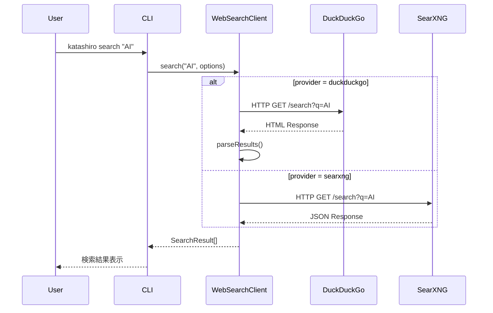
```mermaid
sequenceDiagram
    participant User
    participant CLI
    participant WebSearchClient
    participant DuckDuckGo
    participant SearXNG

    User->>CLI: katashiro search "AI"
    CLI->>WebSearchClient: search("AI", options)
    
    alt provider = duckduckgo
        WebSearchClient->>DuckDuckGo: HTTP GET /search?q=AI
        DuckDuckGo-->>WebSearchClient: HTML Response
        WebSearchClient->>WebSearchClient: parseResults()
    else provider = searxng
        WebSearchClient->>SearXNG: HTTP GET /search?q=AI
        SearXNG-->>WebSearchClient: JSON Response
    end
    
    WebSearchClient-->>CLI: SearchResult[]
    CLI-->>User: 検索結果表示
```

### 2.2 Deep Research シーケンス

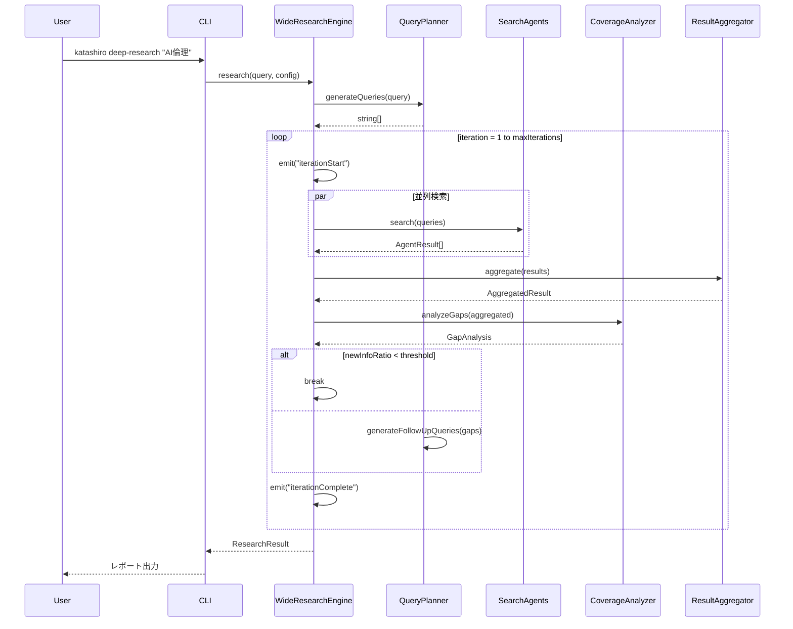
```mermaid
sequenceDiagram
    participant User
    participant CLI
    participant WideResearchEngine
    participant QueryPlanner
    participant SearchAgents
    participant CoverageAnalyzer
    participant ResultAggregator

    User->>CLI: katashiro deep-research "AI倫理"
    CLI->>WideResearchEngine: research(query, config)
    
    WideResearchEngine->>QueryPlanner: generateQueries(query)
    QueryPlanner-->>WideResearchEngine: string[]
    
    loop iteration = 1 to maxIterations
        WideResearchEngine->>WideResearchEngine: emit("iterationStart")
        
        par 並列検索
            WideResearchEngine->>SearchAgents: search(queries)
            SearchAgents-->>WideResearchEngine: AgentResult[]
        end
        
        WideResearchEngine->>ResultAggregator: aggregate(results)
        ResultAggregator-->>WideResearchEngine: AggregatedResult
        
        WideResearchEngine->>CoverageAnalyzer: analyzeGaps(aggregated)
        CoverageAnalyzer-->>WideResearchEngine: GapAnalysis
        
        alt newInfoRatio < threshold
            WideResearchEngine->>WideResearchEngine: break
        else
            QueryPlanner->>QueryPlanner: generateFollowUpQueries(gaps)
        end
        
        WideResearchEngine->>WideResearchEngine: emit("iterationComplete")
    end
    
    WideResearchEngine-->>CLI: ResearchResult
    CLI-->>User: レポート出力
```

---

## 3. 分析フロー

### 3.1 テキスト分析シーケンス

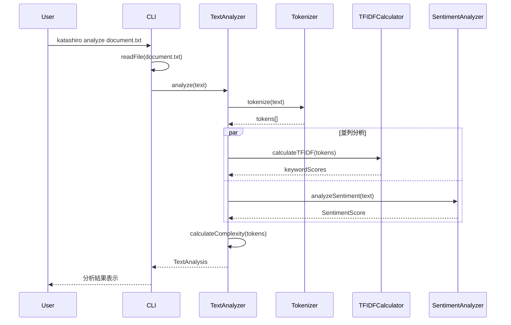
```mermaid
sequenceDiagram
    participant User
    participant CLI
    participant TextAnalyzer
    participant Tokenizer
    participant TFIDFCalculator
    participant SentimentAnalyzer

    User->>CLI: katashiro analyze document.txt
    CLI->>CLI: readFile(document.txt)
    CLI->>TextAnalyzer: analyze(text)
    
    TextAnalyzer->>Tokenizer: tokenize(text)
    Tokenizer-->>TextAnalyzer: tokens[]
    
    par 並列分析
        TextAnalyzer->>TFIDFCalculator: calculateTFIDF(tokens)
        TFIDFCalculator-->>TextAnalyzer: keywordScores
    and
        TextAnalyzer->>SentimentAnalyzer: analyzeSentiment(text)
        SentimentAnalyzer-->>TextAnalyzer: SentimentScore
    end
    
    TextAnalyzer->>TextAnalyzer: calculateComplexity(tokens)
    TextAnalyzer-->>CLI: TextAnalysis
    CLI-->>User: 分析結果表示
```

### 3.2 エンティティ抽出シーケンス

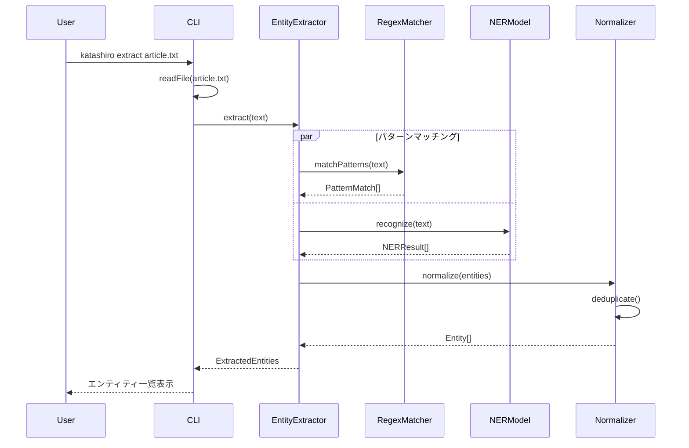
```mermaid
sequenceDiagram
    participant User
    participant CLI
    participant EntityExtractor
    participant RegexMatcher
    participant NERModel
    participant Normalizer

    User->>CLI: katashiro extract article.txt
    CLI->>CLI: readFile(article.txt)
    CLI->>EntityExtractor: extract(text)
    
    par パターンマッチング
        EntityExtractor->>RegexMatcher: matchPatterns(text)
        RegexMatcher-->>EntityExtractor: PatternMatch[]
    and
        EntityExtractor->>NERModel: recognize(text)
        NERModel-->>EntityExtractor: NERResult[]
    end
    
    EntityExtractor->>Normalizer: normalize(entities)
    Normalizer->>Normalizer: deduplicate()
    Normalizer-->>EntityExtractor: Entity[]
    
    EntityExtractor-->>CLI: ExtractedEntities
    CLI-->>User: エンティティ一覧表示
```

### 3.3 フレームワーク分析シーケンス (SWOT)

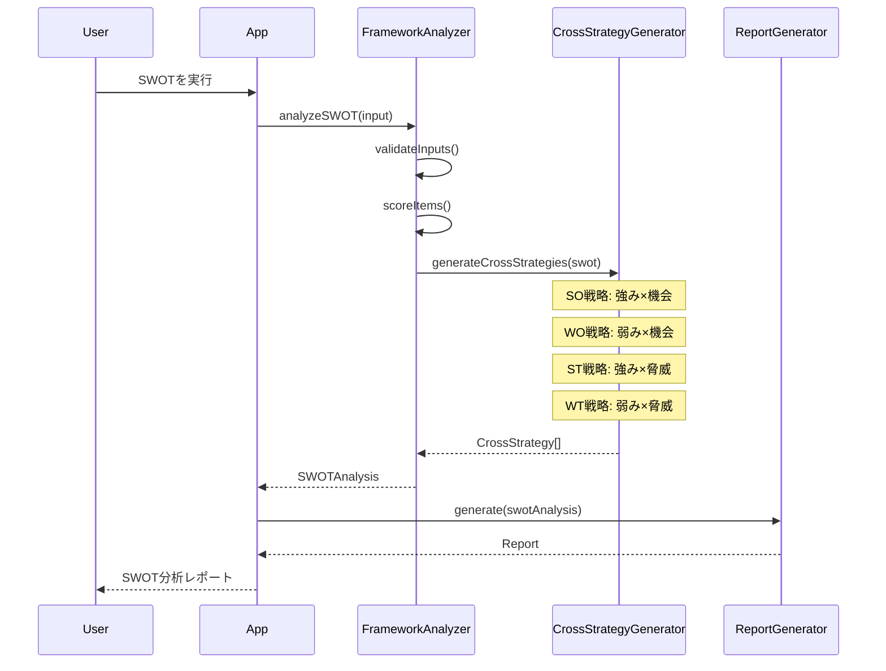
```mermaid
sequenceDiagram
    participant User
    participant App
    participant FrameworkAnalyzer
    participant CrossStrategyGenerator
    participant ReportGenerator

    User->>App: SWOTを実行
    App->>FrameworkAnalyzer: analyzeSWOT(input)
    
    FrameworkAnalyzer->>FrameworkAnalyzer: validateInputs()
    FrameworkAnalyzer->>FrameworkAnalyzer: scoreItems()
    
    FrameworkAnalyzer->>CrossStrategyGenerator: generateCrossStrategies(swot)
    
    Note over CrossStrategyGenerator: SO戦略: 強み×機会
    Note over CrossStrategyGenerator: WO戦略: 弱み×機会
    Note over CrossStrategyGenerator: ST戦略: 強み×脅威
    Note over CrossStrategyGenerator: WT戦略: 弱み×脅威
    
    CrossStrategyGenerator-->>FrameworkAnalyzer: CrossStrategy[]
    FrameworkAnalyzer-->>App: SWOTAnalysis
    
    App->>ReportGenerator: generate(swotAnalysis)
    ReportGenerator-->>App: Report
    App-->>User: SWOT分析レポート
```

---

## 4. 生成フロー

### 4.1 レポート生成シーケンス

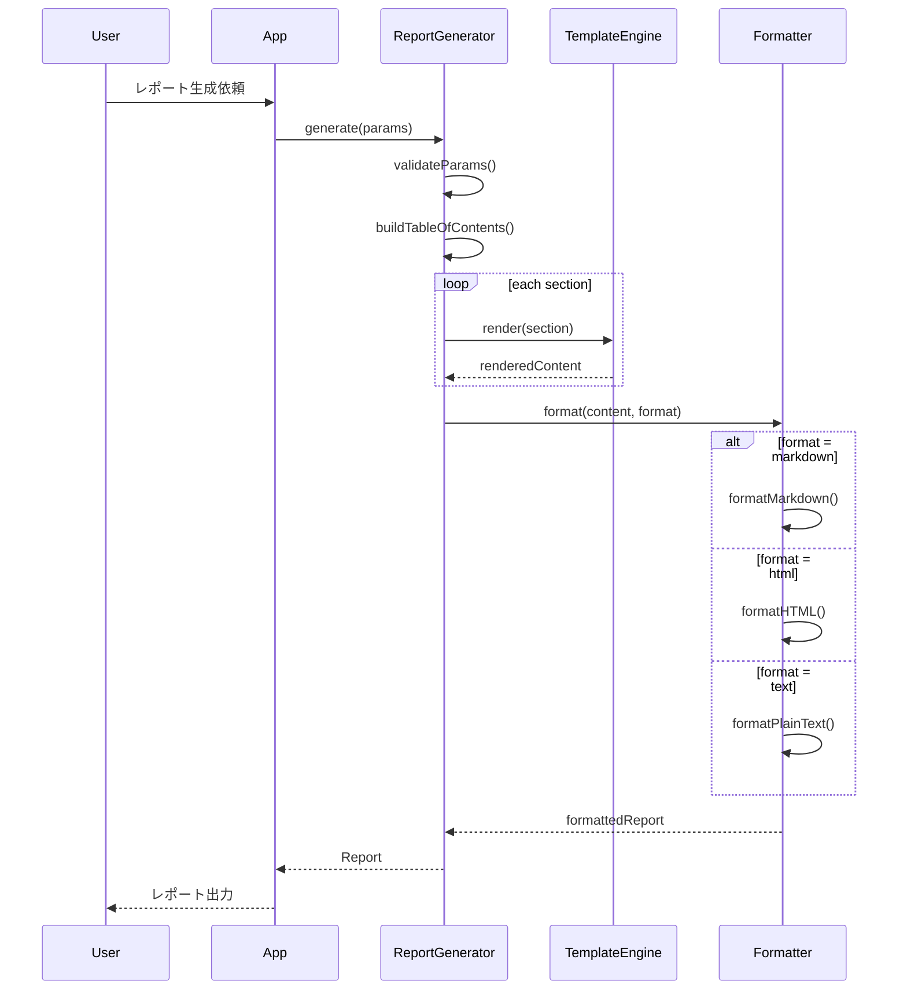
```mermaid
sequenceDiagram
    participant User
    participant App
    participant ReportGenerator
    participant TemplateEngine
    participant Formatter

    User->>App: レポート生成依頼
    App->>ReportGenerator: generate(params)
    
    ReportGenerator->>ReportGenerator: validateParams()
    ReportGenerator->>ReportGenerator: buildTableOfContents()
    
    loop each section
        ReportGenerator->>TemplateEngine: render(section)
        TemplateEngine-->>ReportGenerator: renderedContent
    end
    
    ReportGenerator->>Formatter: format(content, format)
    
    alt format = markdown
        Formatter->>Formatter: formatMarkdown()
    else format = html
        Formatter->>Formatter: formatHTML()
    else format = text
        Formatter->>Formatter: formatPlainText()
    end
    
    Formatter-->>ReportGenerator: formattedReport
    ReportGenerator-->>App: Report
    App-->>User: レポート出力
```

### 4.2 要約生成シーケンス

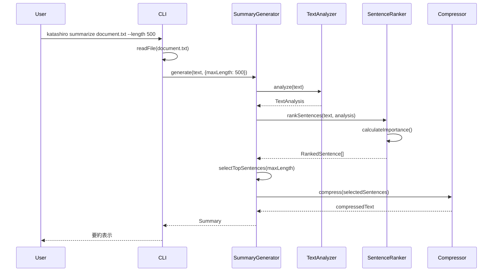
```mermaid
sequenceDiagram
    participant User
    participant CLI
    participant SummaryGenerator
    participant TextAnalyzer
    participant SentenceRanker
    participant Compressor

    User->>CLI: katashiro summarize document.txt --length 500
    CLI->>CLI: readFile(document.txt)
    CLI->>SummaryGenerator: generate(text, {maxLength: 500})
    
    SummaryGenerator->>TextAnalyzer: analyze(text)
    TextAnalyzer-->>SummaryGenerator: TextAnalysis
    
    SummaryGenerator->>SentenceRanker: rankSentences(text, analysis)
    SentenceRanker->>SentenceRanker: calculateImportance()
    SentenceRanker-->>SummaryGenerator: RankedSentence[]
    
    SummaryGenerator->>SummaryGenerator: selectTopSentences(maxLength)
    SummaryGenerator->>Compressor: compress(selectedSentences)
    Compressor-->>SummaryGenerator: compressedText
    
    SummaryGenerator-->>CLI: Summary
    CLI-->>User: 要約表示
```

---

## 5. 知識管理フロー

### 5.1 ナレッジグラフ構築シーケンス

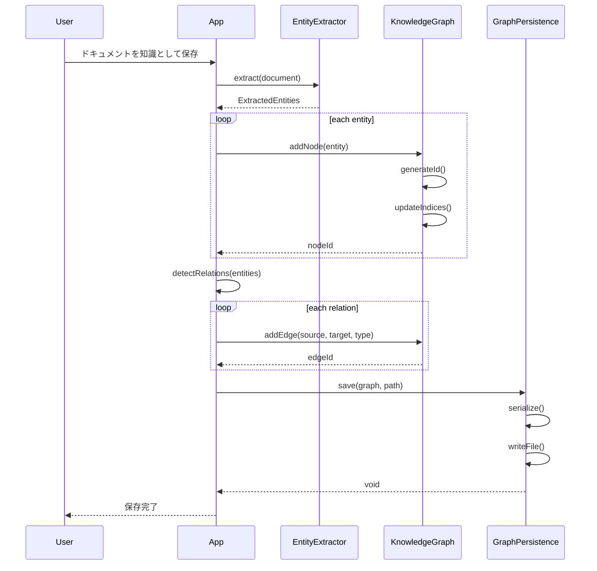
```mermaid
sequenceDiagram
    participant User
    participant App
    participant EntityExtractor
    participant KnowledgeGraph
    participant GraphPersistence

    User->>App: ドキュメントを知識として保存
    App->>EntityExtractor: extract(document)
    EntityExtractor-->>App: ExtractedEntities
    
    loop each entity
        App->>KnowledgeGraph: addNode(entity)
        KnowledgeGraph->>KnowledgeGraph: generateId()
        KnowledgeGraph->>KnowledgeGraph: updateIndices()
        KnowledgeGraph-->>App: nodeId
    end
    
    App->>App: detectRelations(entities)
    
    loop each relation
        App->>KnowledgeGraph: addEdge(source, target, type)
        KnowledgeGraph-->>App: edgeId
    end
    
    App->>GraphPersistence: save(graph, path)
    GraphPersistence->>GraphPersistence: serialize()
    GraphPersistence->>GraphPersistence: writeFile()
    GraphPersistence-->>App: void
    
    App-->>User: 保存完了
```

### 5.2 ナレッジグラフ検索シーケンス

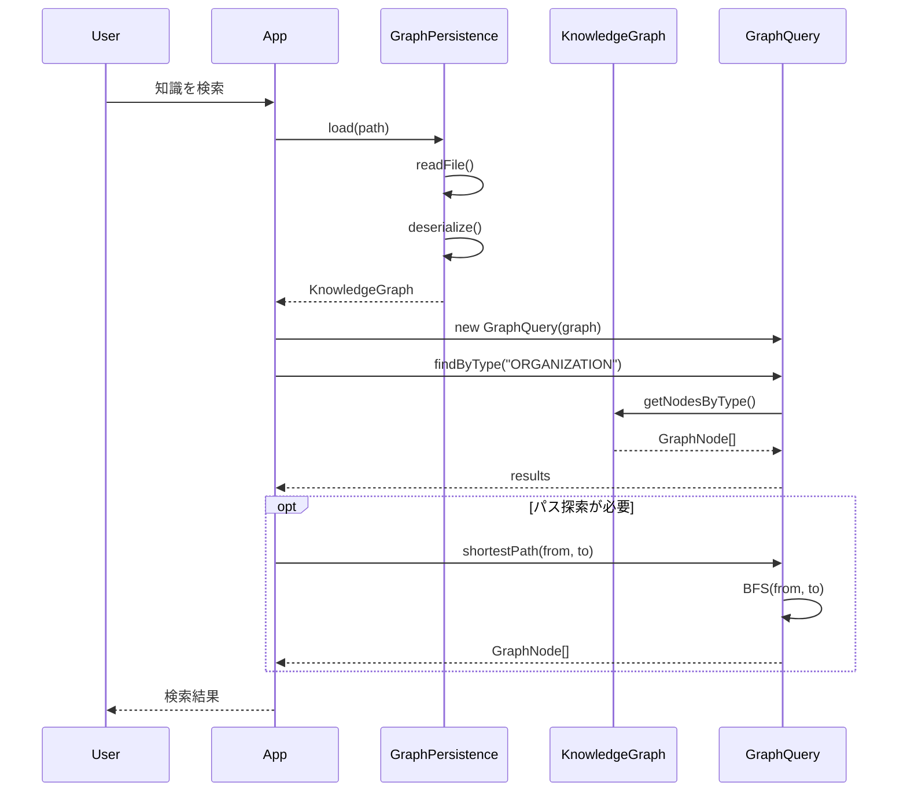
```mermaid
sequenceDiagram
    participant User
    participant App
    participant GraphPersistence
    participant KnowledgeGraph
    participant GraphQuery

    User->>App: 知識を検索
    App->>GraphPersistence: load(path)
    GraphPersistence->>GraphPersistence: readFile()
    GraphPersistence->>GraphPersistence: deserialize()
    GraphPersistence-->>App: KnowledgeGraph
    
    App->>GraphQuery: new GraphQuery(graph)
    App->>GraphQuery: findByType("ORGANIZATION")
    GraphQuery->>KnowledgeGraph: getNodesByType()
    KnowledgeGraph-->>GraphQuery: GraphNode[]
    GraphQuery-->>App: results
    
    opt パス探索が必要
        App->>GraphQuery: shortestPath(from, to)
        GraphQuery->>GraphQuery: BFS(from, to)
        GraphQuery-->>App: GraphNode[]
    end
    
    App-->>User: 検索結果
```

---

## 6. フィードバック学習フロー

### 6.1 Wake-Sleep サイクルシーケンス

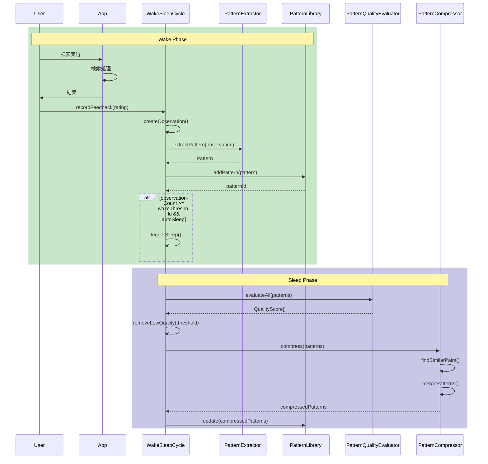
```mermaid
sequenceDiagram
    participant User
    participant App
    participant WakeSleepCycle
    participant PatternExtractor
    participant PatternLibrary
    participant PatternQualityEvaluator
    participant PatternCompressor

    rect rgb(200, 230, 200)
        Note over User,PatternLibrary: Wake Phase
        
        User->>App: 検索実行
        App->>App: 検索処理...
        App-->>User: 結果
        
        User->>WakeSleepCycle: recordFeedback(rating)
        WakeSleepCycle->>WakeSleepCycle: createObservation()
        
        WakeSleepCycle->>PatternExtractor: extractPattern(observation)
        PatternExtractor-->>WakeSleepCycle: Pattern
        
        WakeSleepCycle->>PatternLibrary: addPattern(pattern)
        PatternLibrary-->>WakeSleepCycle: patternId
        
        alt observationCount >= wakeThreshold && autoSleep
            WakeSleepCycle->>WakeSleepCycle: triggerSleep()
        end
    end
    
    rect rgb(200, 200, 230)
        Note over WakeSleepCycle,PatternCompressor: Sleep Phase
        
        WakeSleepCycle->>PatternQualityEvaluator: evaluateAll(patterns)
        PatternQualityEvaluator-->>WakeSleepCycle: QualityScore[]
        
        WakeSleepCycle->>WakeSleepCycle: removeLowQuality(threshold)
        
        WakeSleepCycle->>PatternCompressor: compress(patterns)
        PatternCompressor->>PatternCompressor: findSimilarPairs()
        PatternCompressor->>PatternCompressor: mergePatterns()
        PatternCompressor-->>WakeSleepCycle: compressedPatterns
        
        WakeSleepCycle->>PatternLibrary: update(compressedPatterns)
    end
```

### 6.2 パターンマッチングシーケンス

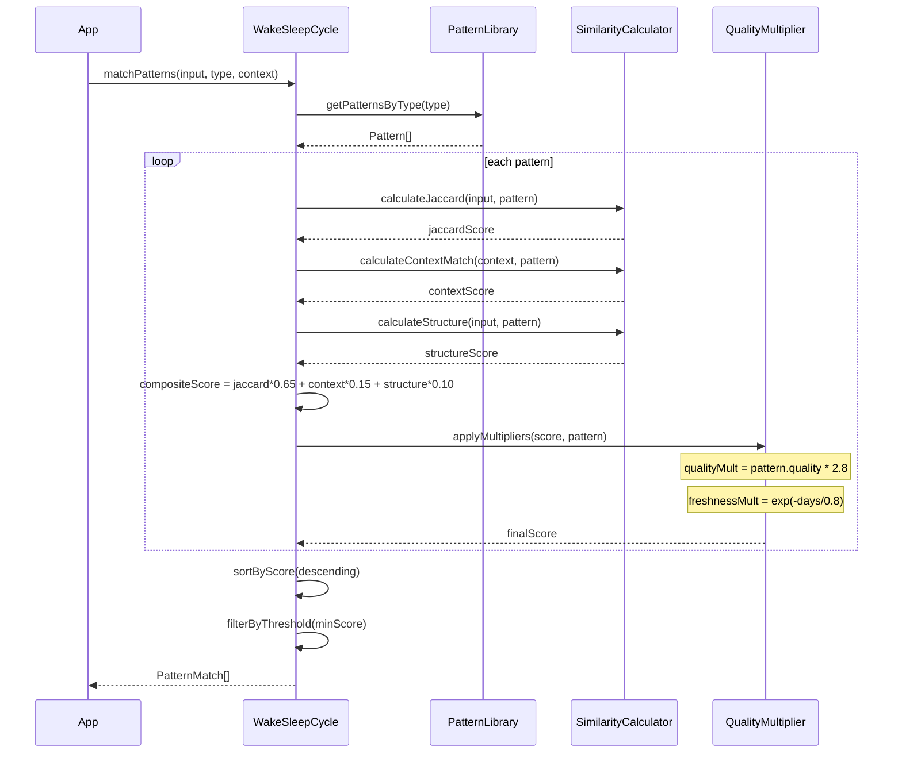
```mermaid
sequenceDiagram
    participant App
    participant WakeSleepCycle
    participant PatternLibrary
    participant SimilarityCalculator
    participant QualityMultiplier

    App->>WakeSleepCycle: matchPatterns(input, type, context)
    
    WakeSleepCycle->>PatternLibrary: getPatternsByType(type)
    PatternLibrary-->>WakeSleepCycle: Pattern[]
    
    loop each pattern
        WakeSleepCycle->>SimilarityCalculator: calculateJaccard(input, pattern)
        SimilarityCalculator-->>WakeSleepCycle: jaccardScore
        
        WakeSleepCycle->>SimilarityCalculator: calculateContextMatch(context, pattern)
        SimilarityCalculator-->>WakeSleepCycle: contextScore
        
        WakeSleepCycle->>SimilarityCalculator: calculateStructure(input, pattern)
        SimilarityCalculator-->>WakeSleepCycle: structureScore
        
        WakeSleepCycle->>WakeSleepCycle: compositeScore = jaccard*0.65 + context*0.15 + structure*0.10
        
        WakeSleepCycle->>QualityMultiplier: applyMultipliers(score, pattern)
        Note over QualityMultiplier: qualityMult = pattern.quality * 2.8
        Note over QualityMultiplier: freshnessMult = exp(-days/0.8)
        QualityMultiplier-->>WakeSleepCycle: finalScore
    end
    
    WakeSleepCycle->>WakeSleepCycle: sortByScore(descending)
    WakeSleepCycle->>WakeSleepCycle: filterByThreshold(minScore)
    
    WakeSleepCycle-->>App: PatternMatch[]
```

---

## 7. オーケストレーションフロー

### 7.1 対話型情報収集シーケンス

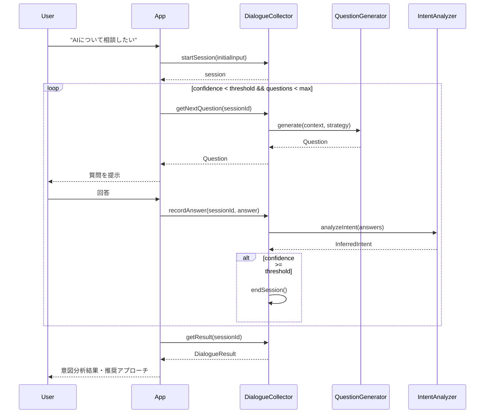
```mermaid
sequenceDiagram
    participant User
    participant App
    participant DialogueCollector
    participant QuestionGenerator
    participant IntentAnalyzer

    User->>App: "AIについて相談したい"
    App->>DialogueCollector: startSession(initialInput)
    DialogueCollector-->>App: session
    
    loop confidence < threshold && questions < max
        App->>DialogueCollector: getNextQuestion(sessionId)
        DialogueCollector->>QuestionGenerator: generate(context, strategy)
        QuestionGenerator-->>DialogueCollector: Question
        DialogueCollector-->>App: Question
        
        App-->>User: 質問を提示
        User->>App: 回答
        
        App->>DialogueCollector: recordAnswer(sessionId, answer)
        DialogueCollector->>IntentAnalyzer: analyzeIntent(answers)
        IntentAnalyzer-->>DialogueCollector: InferredIntent
        
        alt confidence >= threshold
            DialogueCollector->>DialogueCollector: endSession()
        end
    end
    
    App->>DialogueCollector: getResult(sessionId)
    DialogueCollector-->>App: DialogueResult
    App-->>User: 意図分析結果・推奨アプローチ
```

### 7.2 ワークフロー実行シーケンス

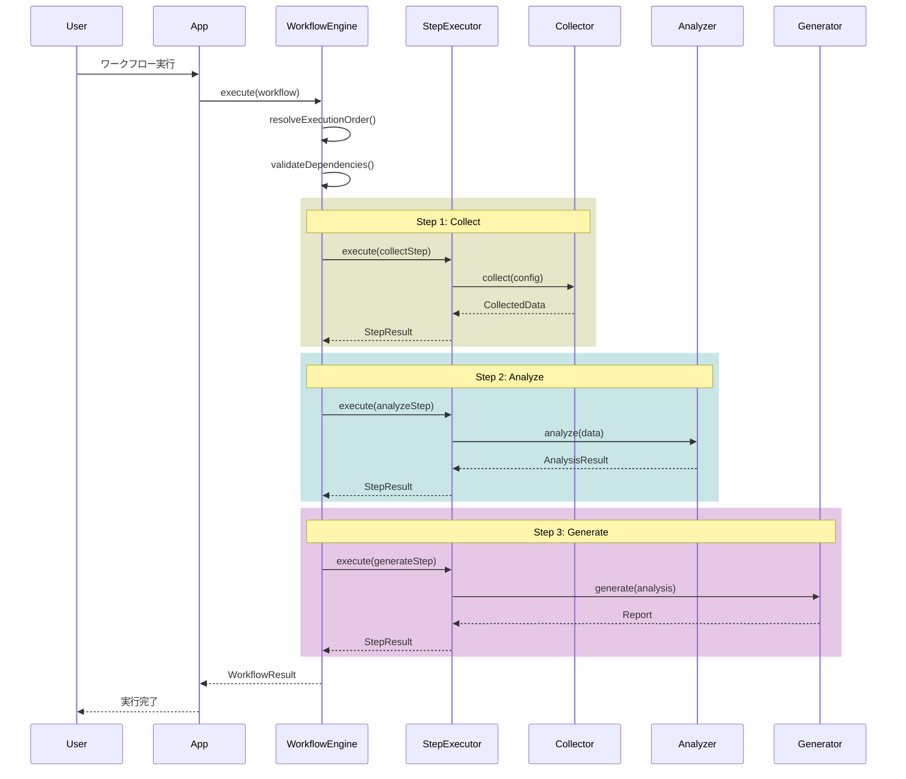
```mermaid
sequenceDiagram
    participant User
    participant App
    participant WorkflowEngine
    participant StepExecutor
    participant Collector
    participant Analyzer
    participant Generator

    User->>App: ワークフロー実行
    App->>WorkflowEngine: execute(workflow)
    
    WorkflowEngine->>WorkflowEngine: resolveExecutionOrder()
    WorkflowEngine->>WorkflowEngine: validateDependencies()
    
    rect rgb(230, 230, 200)
        Note over WorkflowEngine,Collector: Step 1: Collect
        WorkflowEngine->>StepExecutor: execute(collectStep)
        StepExecutor->>Collector: collect(config)
        Collector-->>StepExecutor: CollectedData
        StepExecutor-->>WorkflowEngine: StepResult
    end
    
    rect rgb(200, 230, 230)
        Note over WorkflowEngine,Analyzer: Step 2: Analyze
        WorkflowEngine->>StepExecutor: execute(analyzeStep)
        StepExecutor->>Analyzer: analyze(data)
        Analyzer-->>StepExecutor: AnalysisResult
        StepExecutor-->>WorkflowEngine: StepResult
    end
    
    rect rgb(230, 200, 230)
        Note over WorkflowEngine,Generator: Step 3: Generate
        WorkflowEngine->>StepExecutor: execute(generateStep)
        StepExecutor->>Generator: generate(analysis)
        Generator-->>StepExecutor: Report
        StepExecutor-->>WorkflowEngine: StepResult
    end
    
    WorkflowEngine-->>App: WorkflowResult
    App-->>User: 実行完了
```

---

## 8. セキュリティフロー

### 8.1 アクション承認シーケンス

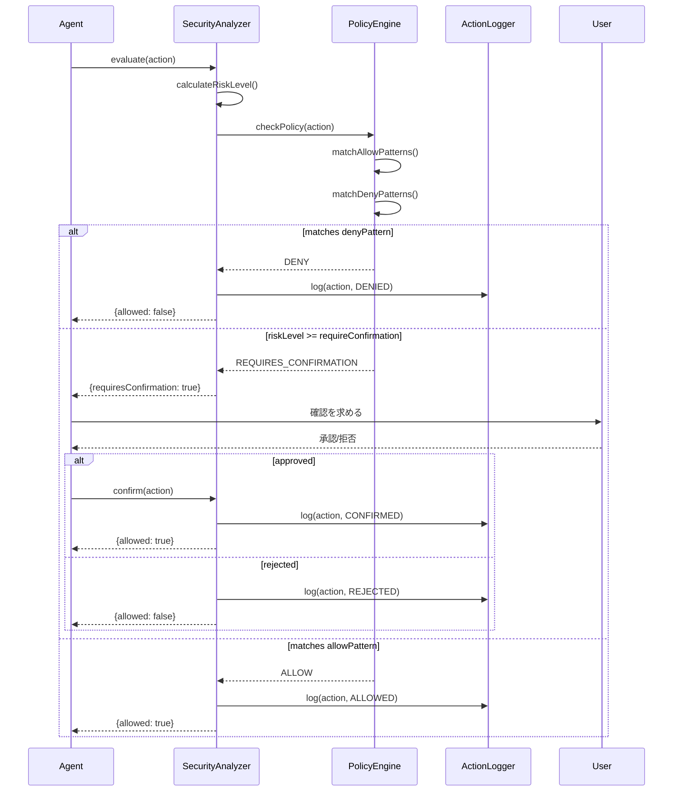
```mermaid
sequenceDiagram
    participant Agent
    participant SecurityAnalyzer
    participant PolicyEngine
    participant ActionLogger
    participant User

    Agent->>SecurityAnalyzer: evaluate(action)
    SecurityAnalyzer->>SecurityAnalyzer: calculateRiskLevel()
    
    SecurityAnalyzer->>PolicyEngine: checkPolicy(action)
    PolicyEngine->>PolicyEngine: matchAllowPatterns()
    PolicyEngine->>PolicyEngine: matchDenyPatterns()
    
    alt matches denyPattern
        PolicyEngine-->>SecurityAnalyzer: DENY
        SecurityAnalyzer->>ActionLogger: log(action, DENIED)
        SecurityAnalyzer-->>Agent: {allowed: false}
    else riskLevel >= requireConfirmation
        PolicyEngine-->>SecurityAnalyzer: REQUIRES_CONFIRMATION
        SecurityAnalyzer-->>Agent: {requiresConfirmation: true}
        Agent->>User: 確認を求める
        User-->>Agent: 承認/拒否
        alt approved
            Agent->>SecurityAnalyzer: confirm(action)
            SecurityAnalyzer->>ActionLogger: log(action, CONFIRMED)
            SecurityAnalyzer-->>Agent: {allowed: true}
        else rejected
            SecurityAnalyzer->>ActionLogger: log(action, REJECTED)
            SecurityAnalyzer-->>Agent: {allowed: false}
        end
    else matches allowPattern
        PolicyEngine-->>SecurityAnalyzer: ALLOW
        SecurityAnalyzer->>ActionLogger: log(action, ALLOWED)
        SecurityAnalyzer-->>Agent: {allowed: true}
    end
```

---

## 9. サンドボックス実行フロー

### 9.1 コード実行シーケンス

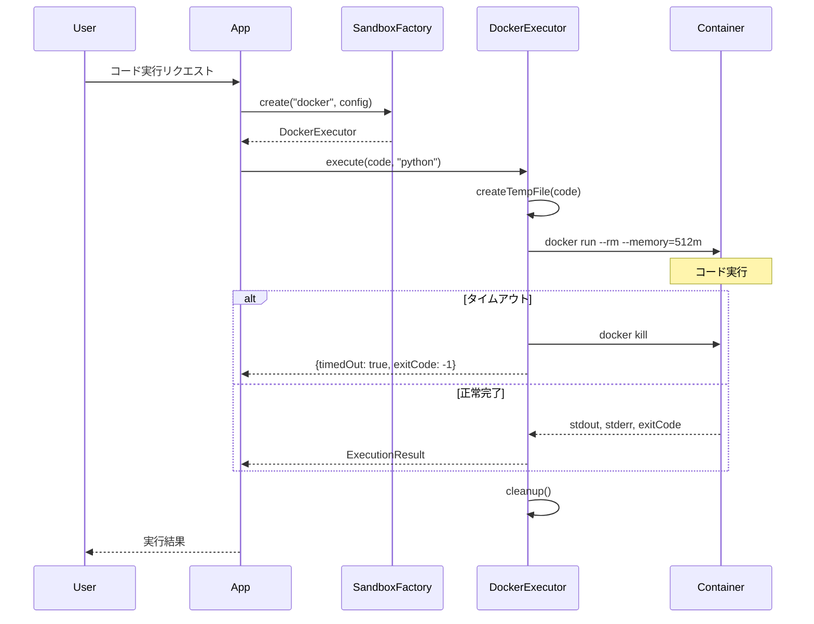
```mermaid
sequenceDiagram
    participant User
    participant App
    participant SandboxFactory
    participant DockerExecutor
    participant Container

    User->>App: コード実行リクエスト
    App->>SandboxFactory: create("docker", config)
    SandboxFactory-->>App: DockerExecutor
    
    App->>DockerExecutor: execute(code, "python")
    DockerExecutor->>DockerExecutor: createTempFile(code)
    
    DockerExecutor->>Container: docker run --rm --memory=512m
    Note over Container: コード実行
    
    alt タイムアウト
        DockerExecutor->>Container: docker kill
        DockerExecutor-->>App: {timedOut: true, exitCode: -1}
    else 正常完了
        Container-->>DockerExecutor: stdout, stderr, exitCode
        DockerExecutor-->>App: ExecutionResult
    end
    
    DockerExecutor->>DockerExecutor: cleanup()
    App-->>User: 実行結果
```

---

## 10. エラーハンドリングフロー

### 10.1 リトライ付きWeb取得シーケンス

```mermaid
sequenceDiagram
    participant App
    participant WebScraper
    participant HTTPClient
    participant RetryHandler

    App->>WebScraper: scrape(url)
    WebScraper->>RetryHandler: withRetry(fetchPage, maxRetries=3)
    
    loop attempt = 1 to 3
        RetryHandler->>HTTPClient: fetch(url)
        
        alt success
            HTTPClient-->>RetryHandler: Response
            RetryHandler-->>WebScraper: ok(content)
            break
        else transient error (timeout, 5xx)
            HTTPClient-->>RetryHandler: Error
            RetryHandler->>RetryHandler: wait(backoff * attempt)
            Note over RetryHandler: 指数バックオフ
        else permanent error (4xx, invalid URL)
            HTTPClient-->>RetryHandler: Error
            RetryHandler-->>WebScraper: err(error)
            break
        end
    end
    
    alt all retries failed
        RetryHandler-->>WebScraper: err(MaxRetriesExceeded)
    end
    
    WebScraper-->>App: Result<ScrapedPage, Error>
```

---

## 11. MCP サーバーフロー

### 11.1 ツール呼び出しシーケンス

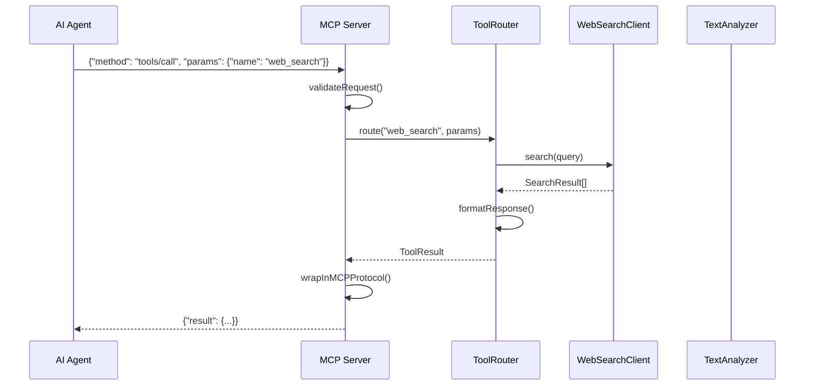
```mermaid
sequenceDiagram
    participant AIAgent as AI Agent
    participant MCPServer as MCP Server
    participant ToolRouter
    participant WebSearchClient
    participant TextAnalyzer

    AIAgent->>MCPServer: {"method": "tools/call", "params": {"name": "web_search"}}
    MCPServer->>MCPServer: validateRequest()
    MCPServer->>ToolRouter: route("web_search", params)
    
    ToolRouter->>WebSearchClient: search(query)
    WebSearchClient-->>ToolRouter: SearchResult[]
    
    ToolRouter->>ToolRouter: formatResponse()
    ToolRouter-->>MCPServer: ToolResult
    
    MCPServer->>MCPServer: wrapInMCPProtocol()
    MCPServer-->>AIAgent: {"result": {...}}
```

### 11.2 ツール一覧取得シーケンス

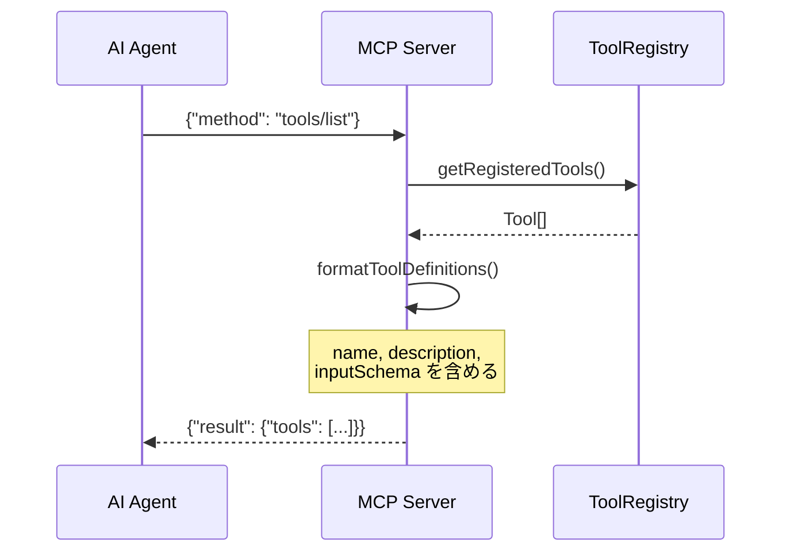
```mermaid
sequenceDiagram
    participant AIAgent as AI Agent
    participant MCPServer as MCP Server
    participant ToolRegistry

    AIAgent->>MCPServer: {"method": "tools/list"}
    MCPServer->>ToolRegistry: getRegisteredTools()
    ToolRegistry-->>MCPServer: Tool[]
    
    MCPServer->>MCPServer: formatToolDefinitions()
    Note over MCPServer: name, description,<br/>inputSchema を含める
    
    MCPServer-->>AIAgent: {"result": {"tools": [...]}}
```

---

## 12. 改訂履歴

| バージョン | 日付 | 変更内容 | 作成者 |
|-----------|------|----------|--------|
| 1.0 | 2026-01-13 | 初版作成 | GitHub Copilot |

---

**文書終了**
