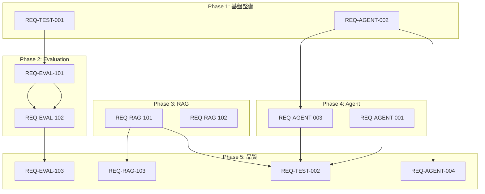

# KATASHIRO v2.0 タスク分解

> **Version**: 1.0.0  
> **Date**: 2026-01-14  
> **Status**: Ready for Implementation  
> **Based on**: REQ-V2.0-ENHANCEMENT.md v1.0.2  

---

## 📋 タスク一覧サマリ

| Phase | 要件ID | タスク数 | 工数(h) | 優先度 |
|-------|--------|----------|---------|--------|
| Phase 1 | REQ-TEST-001, REQ-AGENT-002 | 8 | 4 | P1 |
| Phase 2 | REQ-EVAL-101, REQ-EVAL-102 | 10 | 10 | P1 |
| Phase 3 | REQ-RAG-101, REQ-RAG-102 | 9 | 7 | P1/P2 |
| Phase 4 | REQ-AGENT-003, REQ-AGENT-001 | 8 | 6 | P1/P2 |
| Phase 5 | REQ-EVAL-103, REQ-RAG-103, REQ-AGENT-004, REQ-TEST-002 | 12 | 13 | P2 |
| **合計** | **12要件** | **47タスク** | **40h** | - |

---

## 🔧 Phase 1: 基盤整備（4h）

### REQ-TEST-001: 統合テスト安定化（2h）

| ID | タスク | ファイル | 工数 | 依存 |
|----|--------|----------|------|------|
| T1-001 | Ollamaモック改善 | `packages/llm/src/providers/MockLLMProvider.ts` | 0.5h | - |
| T1-002 | タイムアウト設定統一 | `vitest.config.ts`, 各テストファイル | 0.5h | - |
| T1-003 | 環境変数によるスキップ条件 | `packages/*/tests/**/*.test.ts` | 0.5h | - |
| T1-004 | CI用テスト設定 | `.github/workflows/test.yml` (新規) | 0.5h | T1-003 |

**受け入れ基準チェックリスト**:
- [ ] `MOCK_MODE=true`で全テスト通過
- [ ] タイムアウト: 単体5s、統合30s、E2E60s
- [ ] `CI=true`環境でOllama依存テストをスキップ

---

### REQ-AGENT-002: AgentState（2h）

| ID | タスク | ファイル | 工数 | 依存 |
|----|--------|----------|------|------|
| T1-005 | AgentState型定義 | `packages/orchestrator/src/agent/types.ts` (新規) | 0.5h | - |
| T1-006 | AgentStateManager実装 | `packages/orchestrator/src/agent/AgentStateManager.ts` (新規) | 1h | T1-005 |
| T1-007 | ユニットテスト | `packages/orchestrator/tests/agent/AgentStateManager.test.ts` (新規) | 0.5h | T1-006 |
| T1-008 | index.tsエクスポート | `packages/orchestrator/src/index.ts` | - | T1-006 |

**ファイル構造**:
```
packages/orchestrator/src/
├── agent/           (新規ディレクトリ)
│   ├── types.ts
│   ├── AgentStateManager.ts
│   └── index.ts
└── index.ts         (エクスポート追加)
```

---

## 🎯 Phase 2: Evaluation強化（10h）

### REQ-EVAL-101: LLMJudgeEvaluator（4h）

| ID | タスク | ファイル | 工数 | 依存 |
|----|--------|----------|------|------|
| T2-001 | 型定義追加 | `packages/evaluation/src/types.ts` | 0.5h | - |
| T2-002 | LLMJudgeEvaluator実装 | `packages/evaluation/src/evaluators/LLMJudgeEvaluator.ts` (新規) | 2h | T2-001 |
| T2-003 | プロンプトテンプレート | `packages/evaluation/src/evaluators/prompts/judge.ts` (新規) | 0.5h | - |
| T2-004 | ユニットテスト | `packages/evaluation/tests/evaluators/LLMJudgeEvaluator.test.ts` (新規) | 0.5h | T2-002 |
| T2-005 | 統合テスト（Ollama） | `packages/evaluation/tests/integration/llm-judge.test.ts` (新規) | 0.5h | T2-002 |

**型定義追加内容**:
```typescript
// types.ts に追加
interface EvaluationCriteria {
  name: string;
  description: string;
  weight?: number;
}

interface LLMJudgeEvaluatorConfig {
  llmProvider: LLMProvider;
  criteria: EvaluationCriteria[];
  scale?: { min: number; max: number };
  numJudges?: number;
}

interface DetailedEvaluationResult extends EvaluationResult {
  criteriaScores: Array<{ name: string; score: number; reasoning: string }>;
}
```

---

### REQ-EVAL-102: RAGASメトリクス（6h）

| ID | タスク | ファイル | 工数 | 依存 |
|----|--------|----------|------|------|
| T2-006 | RAGEvaluationInput型追加 | `packages/evaluation/src/types.ts` | 0.5h | - |
| T2-007 | FaithfulnessEvaluator | `packages/evaluation/src/evaluators/ragas/FaithfulnessEvaluator.ts` (新規) | 1h | T2-006, T2-002 |
| T2-008 | ContextRelevancyEvaluator | `packages/evaluation/src/evaluators/ragas/ContextRelevancyEvaluator.ts` (新規) | 1h | T2-006, T2-002 |
| T2-009 | AnswerRelevancyEvaluator | `packages/evaluation/src/evaluators/ragas/AnswerRelevancyEvaluator.ts` (新規) | 1h | T2-006, T2-002 |
| T2-010 | RAGASCompositeEvaluator | `packages/evaluation/src/evaluators/ragas/RAGASCompositeEvaluator.ts` (新規) | 1h | T2-007〜T2-009 |

**ファイル構造**:
```
packages/evaluation/src/evaluators/
├── ragas/           (新規ディレクトリ)
│   ├── FaithfulnessEvaluator.ts
│   ├── ContextRelevancyEvaluator.ts
│   ├── AnswerRelevancyEvaluator.ts
│   ├── RAGASCompositeEvaluator.ts
│   ├── prompts.ts
│   └── index.ts
└── index.ts         (エクスポート追加)
```

---

## 🔍 Phase 3: RAG強化（7h）

### REQ-RAG-101: RAGパイプライン統合（4h）

| ID | タスク | ファイル | 工数 | 依存 |
|----|--------|----------|------|------|
| T3-001 | RAGPipeline型定義 | `packages/rag/src/types.ts` | 0.5h | - |
| T3-002 | RAGPipeline実装 | `packages/rag/src/RAGPipeline.ts` (新規) | 2h | T3-001 |
| T3-003 | プロンプトテンプレート | `packages/rag/src/prompts/rag-prompt.ts` (新規) | 0.5h | - |
| T3-004 | ユニットテスト | `packages/rag/tests/RAGPipeline.test.ts` (新規) | 0.5h | T3-002 |
| T3-005 | 統合テスト | `packages/rag/tests/integration/pipeline.test.ts` (新規) | 0.5h | T3-002 |

**依存関係**:
```
katashiro-rag (RAGPipeline)
├── katashiro-rag/EmbeddingProvider (既存)
├── katashiro-rag/VectorStore (既存)
└── katashiro-llm/LLMProvider (既存、オプショナル)
```

---

### REQ-RAG-102: FileVectorStore（3h）

| ID | タスク | ファイル | 工数 | 依存 |
|----|--------|----------|------|------|
| T3-006 | FileVectorStore型定義 | `packages/rag/src/types.ts` | 0.5h | - |
| T3-007 | FileVectorStore実装 | `packages/rag/src/vectorstore/FileVectorStore.ts` (新規) | 1.5h | T3-006 |
| T3-008 | ユニットテスト | `packages/rag/tests/vectorstore/FileVectorStore.test.ts` (新規) | 0.5h | T3-007 |
| T3-009 | 永続化テスト | `packages/rag/tests/integration/persistence.test.ts` (新規) | 0.5h | T3-007 |

**ファイル構造**:
```
packages/rag/src/vectorstore/
├── InMemoryVectorStore.ts (既存)
├── FileVectorStore.ts     (新規)
└── index.ts               (エクスポート追加)
```

---

## 🤖 Phase 4: Agent統合（6h）

### REQ-AGENT-003: 標準ツールセット（4h）

| ID | タスク | ファイル | 工数 | 依存 |
|----|--------|----------|------|------|
| T4-001 | ツールファクトリ設計 | `packages/orchestrator/src/tools/factory.ts` (新規) | 0.5h | - |
| T4-002 | Collectorツール群 | `packages/orchestrator/src/tools/collector-tools.ts` (新規) | 1h | T4-001 |
| T4-003 | Analyzerツール群 | `packages/orchestrator/src/tools/analyzer-tools.ts` (新規) | 1h | T4-001 |
| T4-004 | Generatorツール群 | `packages/orchestrator/src/tools/generator-tools.ts` (新規) | 0.5h | T4-001 |
| T4-005 | RAGツール群 | `packages/orchestrator/src/tools/rag-tools.ts` (新規) | 0.5h | T4-001 |
| T4-006 | ユニットテスト | `packages/orchestrator/tests/tools/*.test.ts` (新規) | 0.5h | T4-002〜T4-005 |

**ツール一覧**:
```typescript
// Collector
- web_search: WebSearchClient.search
- web_scrape: WebScraper.scrape
- rss_feed: RssFeedReader.read

// Analyzer
- text_analyze: TextAnalyzer.analyze
- entity_extract: EntityExtractor.extract
- topic_model: TopicModeler.model

// Generator
- summarize: SummaryGenerator.generate
- generate_report: ReportGenerator.generate

// RAG
- rag_ingest: RAGPipeline.ingest
- rag_query: RAGPipeline.query
```

---

### REQ-AGENT-001: ToolRegistry拡張（2h）

| ID | タスク | ファイル | 工数 | 依存 |
|----|--------|----------|------|------|
| T4-007 | OpenAI形式エクスポート | `packages/orchestrator/src/tool-registry.ts` | 1h | - |
| T4-008 | MCP形式エクスポート | `packages/orchestrator/src/tool-registry.ts` | 0.5h | - |
| T4-009 | エクスポートテスト | `packages/orchestrator/tests/tool-registry-export.test.ts` (新規) | 0.5h | T4-007, T4-008 |

**追加メソッド**:
```typescript
class ToolRegistry {
  // 既存メソッド...
  
  /** OpenAI Function Calling形式にエクスポート */
  toOpenAIFunctions(): ToolDefinition[];
  
  /** MCP Tool形式にエクスポート */
  toMCPTools(): MCPTool[];
}
```

---

## 📈 Phase 5: 品質向上（13h）

### REQ-EVAL-103: 評価レポート（3h）

| ID | タスク | ファイル | 工数 | 依存 |
|----|--------|----------|------|------|
| T5-001 | EvaluationReporter実装 | `packages/evaluation/src/reporting/EvaluationReporter.ts` (新規) | 2h | - |
| T5-002 | Markdownテンプレート | `packages/evaluation/src/reporting/templates/*.ts` (新規) | 0.5h | - |
| T5-003 | ユニットテスト | `packages/evaluation/tests/reporting/*.test.ts` (新規) | 0.5h | T5-001 |

---

### REQ-RAG-103: Reranker（3h）

| ID | タスク | ファイル | 工数 | 依存 |
|----|--------|----------|------|------|
| T5-004 | Reranker型定義 | `packages/rag/src/types.ts` | 0.5h | - |
| T5-005 | LLMReranker実装 | `packages/rag/src/reranking/LLMReranker.ts` (新規) | 1.5h | T5-004 |
| T5-006 | ユニットテスト | `packages/rag/tests/reranking/*.test.ts` (新規) | 0.5h | T5-005 |
| T5-007 | RAGPipeline統合 | `packages/rag/src/RAGPipeline.ts` | 0.5h | T5-005 |

---

### REQ-AGENT-004: ReActヘルパー（3h）

| ID | タスク | ファイル | 工数 | 依存 |
|----|--------|----------|------|------|
| T5-008 | ReActHelper実装 | `packages/orchestrator/src/agent/ReActHelper.ts` (新規) | 2h | REQ-AGENT-002 |
| T5-009 | パース関数 | `packages/orchestrator/src/agent/parsers.ts` (新規) | 0.5h | - |
| T5-010 | ユニットテスト | `packages/orchestrator/tests/agent/ReActHelper.test.ts` (新規) | 0.5h | T5-008 |

---

### REQ-TEST-002: E2Eテスト（4h）

| ID | タスク | ファイル | 工数 | 依存 |
|----|--------|----------|------|------|
| T5-011 | E2Eテストセットアップ | `packages/katashiro/tests/e2e/setup.ts` (新規) | 0.5h | - |
| T5-012 | リサーチワークフローE2E | `packages/katashiro/tests/e2e/research-workflow.test.ts` (新規) | 1.5h | Phase 1-4 |
| T5-013 | RAGパイプラインE2E | `packages/katashiro/tests/e2e/rag-pipeline.test.ts` (新規) | 1h | Phase 3 |
| T5-014 | エージェントワークフローE2E | `packages/katashiro/tests/e2e/agent-workflow.test.ts` (新規) | 1h | Phase 4 |

---

## 📊 依存関係グラフ



---

## ✅ 実装チェックリスト

### Phase 1 完了条件
- [ ] T1-001〜T1-004: テスト安定化完了
- [ ] T1-005〜T1-008: AgentState実装完了
- [ ] 全2193+テスト通過

### Phase 2 完了条件
- [ ] T2-001〜T2-005: LLMJudgeEvaluator完了
- [ ] T2-006〜T2-010: RAGASメトリクス完了
- [ ] 評価テスト全通過

### Phase 3 完了条件
- [ ] T3-001〜T3-005: RAGPipeline完了
- [ ] T3-006〜T3-009: FileVectorStore完了
- [ ] RAGテスト全通過

### Phase 4 完了条件
- [ ] T4-001〜T4-006: 標準ツールセット完了
- [ ] T4-007〜T4-009: ToolRegistry拡張完了
- [ ] ツールテスト全通過

### Phase 5 完了条件
- [ ] T5-001〜T5-003: 評価レポート完了
- [ ] T5-004〜T5-007: Reranker完了
- [ ] T5-008〜T5-010: ReActHelper完了
- [ ] T5-011〜T5-014: E2Eテスト完了
- [ ] 全テスト通過、カバレッジ80%以上

---

## 📝 変更履歴

| Version | Date | Description |
|---------|------|-------------|
| 1.0.0 | 2026-01-14 | 初版作成（47タスク、40h） |
