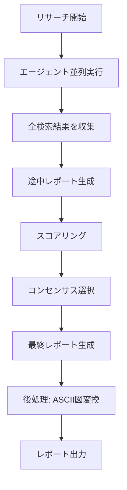

# KATASHIRO v1.3.0 要件定義書

## バージョン情報
- **バージョン**: v1.3.0
- **コードネーム**: Unified Research with Visual Enhancement
- **作成日**: 2026-01-14
- **前提バージョン**: v1.2.0（反復合議型リサーチワークフロー）

---

## 1. 背景と目的

### 1.1 現状の課題

v1.2.0の反復合議型リサーチワークフローには以下の課題がある：

1. **ASCII図の可読性問題**
   - 現在：一部のレポートでASCII図が生成される可能性がある
   - 問題：ASCII図はコピー&ペースト時に崩れる、表示環境依存が高い
   - 影響：レポートの再利用性・可搬性が低い

### 1.2 目的

- **図表の標準化**：ASCII図をMermaid図またはMarkdownテーブルに統一変換
- **レポート品質向上**：機械可読性・人間可読性の両方を向上

---

## 2. 機能要件

### REQ-1.3.0-VIS-001: ASCII図からMermaid/Markdownへの変換

**概要**: 最終レポート生成後、ASCII図を検出してMermaidまたはMarkdownに変換

**受入条件（AC）**:
1. AC1: ASCII形式のフローチャートがMermaid flowchartに変換されること
2. AC2: ASCII形式のテーブルがMarkdownテーブルに変換されること
3. AC3: ASCII形式のツリー図がMarkdown箇条書きまたはMermaid graphに変換されること
4. AC4: 変換できない図は元のまま保持し、警告ログを出力すること
5. AC5: 変換後の図が元の意図を保持していること（情報損失なし）

**変換対象パターン**:

| パターン | 入力例 | 出力形式 |
|----------|--------|----------|
| ASCII Flowchart | `[Start] --> [Process]` | Mermaid flowchart |
| ASCII Table | `+----+----+` | Markdown Table |
| ASCII Tree | `├── item1` | Markdown List |
| ASCII Box | `┌───┐` | Mermaid diagram |

---

### REQ-1.3.0-VIS-002: ReportPostProcessor クラス

**概要**: レポート後処理を担当する新規クラス

**受入条件（AC）**:
1. AC1: `ReportPostProcessor`クラスが作成されること
2. AC2: `process(report: string): string`メソッドで変換を実行できること
3. AC3: 変換オプションで出力形式（mermaid優先/markdown優先）を選択できること
4. AC4: 変換履歴（何を何に変換したか）をメタデータとして返却できること

**クラス設計**:
```typescript
interface PostProcessorOptions {
  preferMermaid: boolean;        // Mermaid優先フラグ
  preserveOriginal: boolean;     // 元のASCII図も保持
  strictMode: boolean;           // 変換失敗時にエラーを投げる
}

interface PostProcessResult {
  processedReport: string;       // 変換後レポート
  conversions: ConversionRecord[]; // 変換記録
  warnings: string[];            // 警告メッセージ
}

interface ConversionRecord {
  original: string;              // 元のASCII図
  converted: string;             // 変換後の図
  type: 'flowchart' | 'table' | 'tree' | 'box';
  success: boolean;
}

class ReportPostProcessor {
  constructor(options?: Partial<PostProcessorOptions>);
  process(report: string): PostProcessResult;
  detectAsciiDiagrams(text: string): AsciiDiagram[];
  convertToMermaid(ascii: AsciiDiagram): string;
  convertToMarkdownTable(ascii: AsciiDiagram): string;
}
```

---

### REQ-1.3.0-INT-001: ConsensusResearchEngineへの統合

**概要**: v1.2.0のConsensusResearchEngineに新機能を統合

**受入条件（AC）**:
1. AC1: 設定オプションに`postProcess: PostProcessorOptions`を追加
2. AC2: 最終レポート生成時に自動的に後処理が実行されること
3. AC3: v1.2.0の既存動作との後方互換性を維持すること（オプトアウト可能）

**設定拡張**:
```typescript
interface ConsensusResearchConfig {
  // v1.2.0既存設定
  agentCount: number;
  iterationCount: number;
  // ...

  // v1.3.0追加設定
  postProcess: {
    enabled: boolean;            // 後処理有効化（default: true）
    preferMermaid: boolean;      // Mermaid優先（default: true）
    preserveOriginal: boolean;   // 元図保持（default: false）
  };
}
```

---

## 3. 非機能要件

### NFR-1.3.0-001: パフォーマンス

- 後処理による追加時間は500ms以内であること
- 大規模レポート（10万文字以上）でも処理可能であること

### NFR-1.3.0-002: 互換性

- v1.2.0のAPIと後方互換性を維持すること
- 新オプションはすべてデフォルト値を持ち、既存コードの変更不要

### NFR-1.3.0-003: テスト

- 新機能に対するユニットテストカバレッジ80%以上
- ASCII図変換の境界ケーステスト

---

## 4. 設計概要

### 4.1 アーキテクチャ変更

```
v1.2.0:
┌─────────────────────────────────────────────────────┐
│ ConsensusResearchEngine                             │
│  ├─ ResearchAgent[] (3)                             │
│  ├─ ReportScorer                                    │
│  └─ ConsensusSelector                               │
└─────────────────────────────────────────────────────┘

v1.3.0:
┌─────────────────────────────────────────────────────┐
│ ConsensusResearchEngine                             │
│  ├─ ResearchAgent[] (3)                             │
│  ├─ ReportScorer                                    │
│  ├─ ConsensusSelector                               │
│  └─ ReportPostProcessor [NEW]                       │
│       ├─ AsciiDiagramDetector                       │
│       ├─ MermaidConverter                           │
│       └─ MarkdownTableConverter                     │
└─────────────────────────────────────────────────────┘
```

### 4.2 処理フロー変更



---

## 5. 影響範囲

### 5.1 変更対象ファイル

| ファイル | 変更内容 |
|----------|----------|
| `packages/orchestrator/src/consensus/types.ts` | 新型定義追加 |
| `packages/orchestrator/src/consensus/ConsensusResearchEngine.ts` | 後処理統合 |
| `packages/orchestrator/src/consensus/ReportPostProcessor.ts` | **新規作成** |
| `packages/orchestrator/src/consensus/AsciiDiagramConverter.ts` | **新規作成** |

### 5.2 新規ファイル

- `ReportPostProcessor.ts`: 後処理メインクラス
- `AsciiDiagramConverter.ts`: ASCII図変換ロジック
- `__tests__/ReportPostProcessor.test.ts`: テスト
- `__tests__/AsciiDiagramConverter.test.ts`: テスト

---

## 6. テスト計画

### 6.1 ユニットテスト

| テストケース | 期待結果 |
|--------------|----------|
| ASCIIフローチャート変換 | Mermaid flowchartに正常変換 |
| ASCIIテーブル変換 | Markdownテーブルに正常変換 |
| 複合ASCII図 | 複数の図が正しく変換 |
| 変換失敗ケース | 警告出力、元図保持 |
| 後方互換性 | `postProcess.enabled: false`でv1.2.0動作 |

### 6.2 統合テスト

- フルワークフロー実行
- 大規模レポート後処理
- パフォーマンス計測

---

## 7. リリース計画

### 7.1 マイルストーン

| フェーズ | 内容 | 目標 |
|----------|------|------|
| Phase 1 | 要件定義・設計 | 完了 |
| Phase 2 | ReportPostProcessor実装 | TBD |
| Phase 3 | ASCII図変換実装 | TBD |
| Phase 4 | 統合・テスト | TBD |
| Phase 5 | ドキュメント更新・リリース | TBD |

### 7.2 バージョニング

- `@nahisaho/katashiro-orchestrator`: 1.2.0 → 1.3.0
- `@nahisaho/katashiro`: 1.2.0 → 1.3.0
- `katashiro` (CLI): 1.2.0 → 1.3.0

---

## 8. 承認

| 役割 | 名前 | 日付 | 承認 |
|------|------|------|------|
| 要件定義者 | KATASHIRO Team | 2026-01-14 | ✅ |
| レビュアー | - | - | - |
| 承認者 | - | - | - |

---

*Document generated by KATASHIRO v1.2.0*
