# MUSUBIX Test Generation Skill

This skill guides you through generating comprehensive test suites that maintain traceability.

## Overview

MUSUBIX follows **Article III - Test-First**: Red-Green-Blue TDD cycle.

```mermaid
flowchart LR
    RED[🔴 Red<br/>Failing Test] --> GREEN[🟢 Green<br/>Minimal Code]
    GREEN --> BLUE[🔵 Blue<br/>Refactor]
    BLUE --> RED
```



## Test Structure

### Unit Test Template

```typescript
/**
 * @requirement REQ-XXX-NNN
 * @design DES-XXX-NNN
 */
import { describe, it, expect, beforeEach } from 'vitest';
import { XxxService } from './xxx-service.js';
import { resetXxxCounter } from './xxx-entity.js';

describe('XxxService', () => {
  let service: XxxService;
  let repository: MockXxxRepository;

  beforeEach(() => {
    // BP-TEST-001: Reset counters before each test
    resetXxxCounter();
    repository = new MockXxxRepository();
    service = new XxxService(repository);
  });

  describe('create', () => {
    it('should create entity with valid input', async () => {
      // Arrange
      const input = { name: 'Test', value: 100 };
      
      // Act
      const result = await service.create(input);
      
      // Assert
      expect(result.isOk()).toBe(true);
      if (result.isOk()) {
        expect(result.value.name).toBe('Test');
      }
    });

    it('should return error for invalid input', async () => {
      // Arrange
      const input = { name: '', value: -1 };
      
      // Act
      const result = await service.create(input);
      
      // Assert
      expect(result.isErr()).toBe(true);
    });
  });
});
```

### Integration Test Template

```typescript
/**
 * @requirement REQ-XXX-NNN
 * @design DES-XXX-NNN
 */
import { describe, it, expect, beforeAll, afterAll } from 'vitest';

describe('XxxService Integration', () => {
  beforeAll(async () => {
    // Setup test environment
  });

  afterAll(async () => {
    // Cleanup
  });

  it('should complete full workflow', async () => {
    // Test full user journey
  });
});
```

## Best Practices for Testing

### BP-TEST-001: Test Counter Reset

```typescript
beforeEach(() => {
  resetPetCounter();  // Reset ID counters
  resetReservationCounter();
});
```

### BP-TEST-002: Verify API Before Test

```typescript
// ✅ Check actual API signature first
const service = new PetService(repository);
// Verify method exists and parameters match
```

### BP-TEST-004: Result Type Test Pattern

```typescript
// ✅ Test both success and failure cases
it('should handle success', async () => {
  const result = await service.create(validInput);
  expect(result.isOk()).toBe(true);
  if (result.isOk()) {
    expect(result.value.id).toBeDefined();
  }
});

it('should handle failure', async () => {
  const result = await service.create(invalidInput);
  expect(result.isErr()).toBe(true);
  if (result.isErr()) {
    expect(result.error.message).toContain('validation');
  }
});
```

### BP-TEST-005: Status Transition Testing

```typescript
describe('status transitions', () => {
  // Valid transitions
  it('should allow draft -> active', () => {
    const result = workflow.transition('draft', 'activate');
    expect(result).toBe('active');
  });

  // Invalid transitions
  it('should reject completed -> draft', () => {
    expect(() => workflow.transition('completed', 'revert'))
      .toThrow('Invalid transition');
  });
});
```

## Test Categories

| Category | Purpose | Location |
|----------|---------|----------|
| Unit | Single component | `__tests__/unit/` |
| Integration | Multiple components | `__tests__/integration/` |
| E2E | Full user flows | `__tests__/e2e/` |

## CLI Commands

```bash
# Generate tests from design
npx musubix test generate storage/design/DES-XXX.md

# Run all tests
npm test

# Coverage report
npx musubix test coverage src/

# Run specific test file
npm test -- xxx.test.ts
```

## Vitest Configuration

```typescript
// vitest.config.ts
import { defineConfig } from 'vitest/config';

export default defineConfig({
  test: {
    globals: true,
    environment: 'node',
    include: ['**/*.test.ts'],
    coverage: {
      provider: 'v8',
      reporter: ['text', 'json', 'html'],
    },
  },
});
```

## Coverage Targets

| Metric | Target |
|--------|--------|
| Line Coverage | ≥80% |
| Branch Coverage | ≥75% |
| Function Coverage | ≥90% |

## Related Skills

- `musubix-sdd-workflow` - Full SDD workflow with TDD
- `musubix-code-generation` - Generate code to test
- `musubix-traceability` - Link tests to requirements
