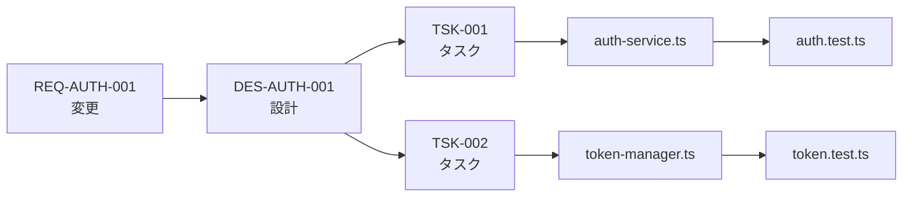

# MUSUBIX Traceability Skill

This skill guides you through maintaining full traceability across the development lifecycle.

## Overview

MUSUBIX enforces **Article V - Traceability**: Complete bidirectional tracing between:

```
Requirements (REQ-*) ↔ Design (DES-*) ↔ Tasks (TSK-*) ↔ Code ↔ Tests
```

## Traceability Matrix

### Creating a Traceability Matrix

```markdown
# Traceability Matrix

| 要件ID | 設計ID | タスクID | コード | テスト |
|--------|--------|---------|--------|--------|
| REQ-AUTH-001 | DES-AUTH-001 | TSK-001 | src/auth/auth-service.ts | auth.test.ts |
| REQ-AUTH-002 | DES-AUTH-001 | TSK-002 | src/auth/token-manager.ts | token.test.ts |
```

### CLI Commands

```bash
# Generate traceability matrix
npx musubix trace matrix

# Impact analysis for a specific requirement
npx musubix trace impact REQ-AUTH-001

# Validate all traceability links
npx musubix trace validate
```

## Traceability in Code

### Adding Traceability Comments

```typescript
/**
 * AuthService - 認証サービス
 * @requirement REQ-AUTH-001
 * @design DES-AUTH-001
 * @task TSK-001
 */
export class AuthService {
  /**
   * ユーザー認証
   * @requirement REQ-AUTH-001
   */
  async authenticate(credentials: Credentials): Promise<Result<Token, AuthError>> {
    // Implementation
  }
}
```

### Test Traceability

```typescript
/**
 * @requirement REQ-AUTH-001
 * @design DES-AUTH-001
 */
describe('AuthService', () => {
  describe('authenticate', () => {
    it('should return token for valid credentials', async () => {
      // Test implementation
    });
  });
});
```

## Impact Analysis

When a requirement changes, identify all affected artifacts:



### Impact Analysis Steps

1. Identify changed requirement (REQ-*)
2. Find linked designs (DES-*)
3. Find linked tasks (TSK-*)
4. Locate affected code files
5. Identify tests to update
6. Update all artifacts

## Traceability Storage

```
storage/traceability/
├── matrix.json           # Full traceability matrix
├── requirements-map.json # REQ -> DES mappings
├── design-map.json       # DES -> TSK mappings
└── code-map.json         # TSK -> Code mappings
```

## Verification Checklist

Before completing any feature:

- [ ] All requirements have linked designs
- [ ] All designs have linked tasks
- [ ] All tasks have linked code
- [ ] All code has linked tests
- [ ] Traceability comments in code
- [ ] Matrix updated

## MCP Tool

Use MCP tool for automated validation:

```
Tool: sdd_validate_traceability
Description: Validates bidirectional traceability across all artifacts
```

## Related Skills

- `musubix-sdd-workflow` - Full SDD workflow
- `musubix-ears-validation` - Requirements validation
- `musubix-test-generation` - Generate tests with traceability
