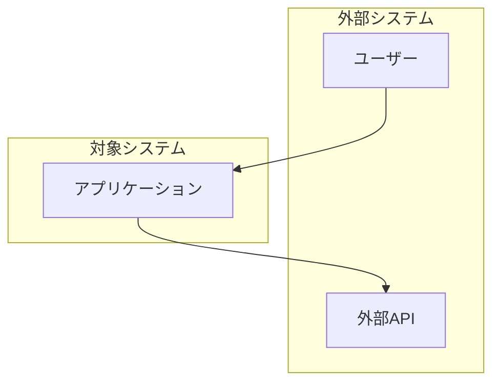
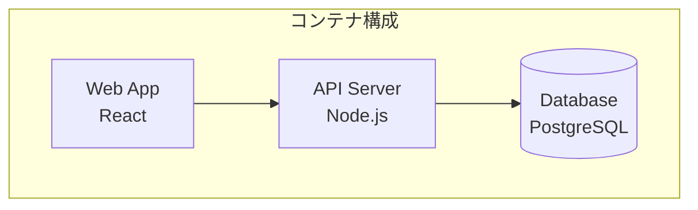
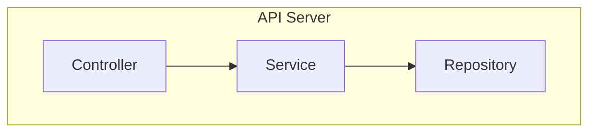

# MUSUBIX C4 Design Skill

This skill guides you through creating C4 model architecture designs for MUSUBIX projects.

## Overview

The C4 model provides four levels of abstraction for describing software architecture:

1. **Context** - System boundaries and external actors
2. **Container** - Technology choices and deployable units
3. **Component** - Internal structure of containers
4. **Code** - Implementation details (optional)

## Prerequisites

Before creating designs:

1. Read requirements from `storage/specs/` (REQ-* files)
2. Check `steering/structure.ja.md` for architecture guidelines
3. Review `steering/tech.ja.md` for technology constraints

## Design Document Template

```markdown
# DES-[CATEGORY]-[NUMBER]: [Design Title]

## メタデータ
- **作成日**: YYYY-MM-DD
- **トレーサビリティ**: REQ-XXX-NNN

## 1. Context Level

### システムコンテキスト図
[External actors and systems that interact with our system]

### 外部アクター
| アクター | 説明 | インタラクション |
|---------|------|-----------------|
| User | システム利用者 | Web UI経由でアクセス |

## 2. Container Level

### コンテナ構成
| コンテナ | 技術 | 責務 |
|---------|------|------|
| Web App | React/Next.js | UI提供 |
| API Server | Node.js/Express | ビジネスロジック |
| Database | PostgreSQL | データ永続化 |

### コンテナ間通信
[Describe how containers communicate]

## 3. Component Level

### [Container Name] コンポーネント

| コンポーネント | 種別 | 責務 | 依存先 |
|---------------|------|------|--------|
| XxxService | Service | ビジネスロジック | XxxRepository |
| XxxRepository | Repository | データアクセス | Database |
| XxxController | Controller | リクエスト処理 | XxxService |

## 4. 設計パターン

### 適用パターン
| パターン | 適用箇所 | 理由 |
|---------|---------|------|
| Repository | データアクセス層 | 永続化の抽象化 |
| Service | ビジネス層 | ロジックの集約 |
| Factory | オブジェクト生成 | 生成ロジックの分離 |

## 5. 非機能要件への対応

### セキュリティ
- 認証: [方式]
- 認可: [方式]
- データ保護: [方式]

### スケーラビリティ
- [スケーリング戦略]

### 可用性
- [可用性設計]
```

## C4 Diagram Syntax (Mermaid)

### Context Diagram


### Container Diagram


### Component Diagram


## Design Patterns Reference

| パターン | 用途 | 適用場面 |
|---------|------|---------|
| **Repository** | データアクセス抽象化 | DB操作 |
| **Service** | ビジネスロジック集約 | ユースケース実装 |
| **Factory** | オブジェクト生成 | 複雑な生成ロジック |
| **Strategy** | アルゴリズム切替 | 認証方式、計算方式 |
| **Observer** | イベント通知 | 状態変更の伝播 |
| **Decorator** | 機能追加 | ログ、キャッシュ |

## Domain-Specific Components

Use `npx musubix design generate` to get domain-specific component recommendations for 62 domains.

## Output Location

Save design documents to:
```
storage/design/DES-[CATEGORY]-[NUMBER].md
```

## Related Skills

- `musubix-ears-validation` - Requirements validation
- `musubix-code-generation` - Generate code from design
- `musubix-adr-generation` - Document architecture decisions
