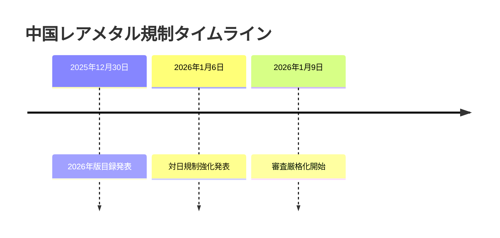
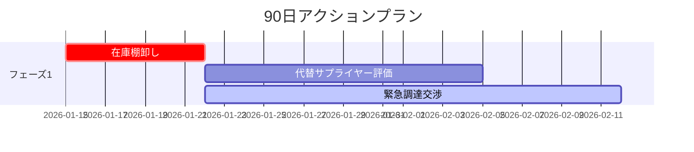
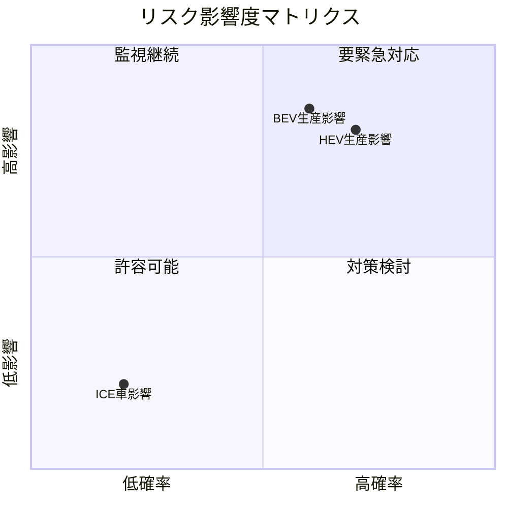
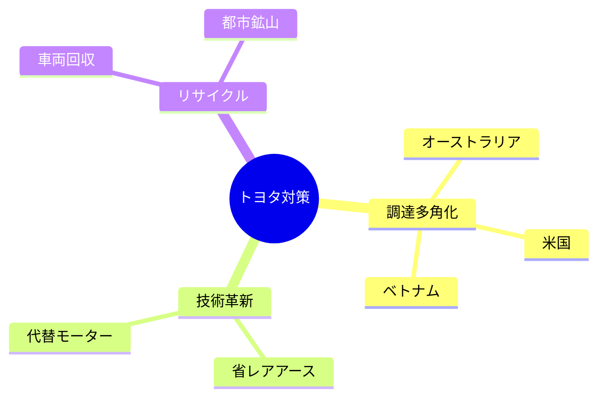

# KATASHIRO v1.1.0 設計ドキュメント

**作成日**: 2026-01-14  
**バージョン**: 1.1.0  
**ステータス**: 設計中  
**関連要件**: [REQ-v1.1.0.md](../specs/REQ-v1.1.0.md)

---

## 1. 概要

### 1.1 目的

本ドキュメントは、KATASHIRO v1.1.0で実装する機能の詳細設計を定義する。

### 1.2 スコープ

| 設計ID | 対応要件 | 概要 |
|--------|----------|------|
| DES-1.1.0-VIS-001 | REQ-1.1.0-VIS-001 | Mermaidタイムライン生成 |
| DES-1.1.0-VIS-002 | REQ-1.1.0-VIS-002 | Mermaidガントチャート生成 |
| DES-1.1.0-VIS-003 | REQ-1.1.0-VIS-003 | Mermaid四象限図生成 |
| DES-1.1.0-VIS-004 | REQ-1.1.0-VIS-004 | Mermaidマインドマップ生成 |
| DES-1.1.0-RPT-001 | REQ-1.1.0-RPT-001 | レポートセクション図表統合 |
| DES-1.1.0-RPT-002 | REQ-1.1.0-RPT-002 | 図表ヒントコメント記法 |
| DES-1.1.0-ERR-001 | REQ-1.1.0-ERR-001 | 無効データハンドリング |

### 1.3 既存アーキテクチャ

```
packages/generator/src/chart/
├── DiagramGenerator.ts    # 高レベルAPI（拡張対象）
├── MermaidBuilder.ts      # Mermaid構文生成（既存利用）
└── types.ts               # 型定義（拡張対象）
```

**既存メソッド（DiagramGenerator）**:
- `generateFlowchart()` - フローチャート（非同期）
- `generateGanttChart()` - ガントチャート（非同期）
- `generateMindmap()` - マインドマップ（非同期）
- `generateTimeline()` - タイムライン（非同期）
- `generateMarkdownTable()` - Markdownテーブル（同期）
- `generateMermaidFlowchart()` - Mermaidフローチャート文字列（同期）
- `generateMarkdownTree()` - Markdownツリー（同期）

**既存メソッド（MermaidBuilder）**:
- `buildFlowchart()` - フローチャート構文
- `buildGanttChart()` - ガントチャート構文
- `buildMindmap()` - マインドマップ構文
- `buildTimeline()` - タイムライン構文

---

## 2. 詳細設計

### 2.1 DES-1.1.0-VIS-001: Mermaidタイムライン生成

#### 2.1.1 設計方針

既存の `generateTimeline()` は非同期でResult型を返すが、レポート埋め込み用に**同期的にMermaid文字列を返す**新メソッドを追加。

#### 2.1.2 インターフェース設計

```typescript
// packages/generator/src/chart/types.ts に追加

/**
 * タイムラインイベント
 * @since 1.1.0
 */
export interface TimelineEvent {
  /** 期間（"2026年1月" or "2026-01-06"） */
  period: string;
  /** イベントタイトル */
  title: string;
  /** 詳細説明（オプション） */
  description?: string;
}

/**
 * タイムラインデータ
 * @since 1.1.0
 */
export interface TimelineData {
  /** タイムライン全体のタイトル */
  title?: string;
  /** イベント一覧 */
  events: TimelineEvent[];
}
```

#### 2.1.3 メソッド設計

```typescript
// packages/generator/src/chart/DiagramGenerator.ts に追加

/**
 * Mermaidタイムライン文字列を生成
 * @requirement REQ-1.1.0-VIS-001
 * @param data タイムラインデータ
 * @returns Mermaid timeline構文文字列
 * @since 1.1.0
 */
generateMermaidTimeline(data: TimelineData): string {
  // AC1: 空データチェック
  if (!data.events || data.events.length === 0) {
    console.warn('[DiagramGenerator] Timeline has no events');
    return '';
  }

  const lines: string[] = ['timeline'];
  
  // AC3: タイトル行
  if (data.title) {
    lines.push(`    title ${this.escapeLabel(data.title)}`);
  }

  // AC2: イベント行
  for (const event of data.events) {
    lines.push(`    ${this.escapeLabel(event.period)} : ${this.escapeLabel(event.title)}`);
  }

  return lines.join('\n');
}
```

#### 2.1.4 出力フォーマット



---

### 2.2 DES-1.1.0-VIS-002: Mermaidガントチャート生成

#### 2.2.1 設計方針

既存の `MermaidBuilder.buildGanttChart()` を活用し、同期的に文字列を返す簡易APIを追加。

#### 2.2.2 インターフェース設計

```typescript
// packages/generator/src/chart/types.ts に追加

/**
 * ガントタスク（拡張版）
 * @since 1.1.0
 */
export interface ExtendedGanttTask {
  /** タスクID */
  id: string;
  /** タスク名 */
  name: string;
  /** 開始日（"2026-01-15" or "after task1"） */
  start: string;
  /** 期間（"7d", "2w" など） */
  duration?: string;
  /** 終了日（durationの代替） */
  end?: string;
  /** ステータス */
  status?: 'done' | 'active' | 'crit' | 'milestone';
  /** セクション */
  section?: string;
}

/**
 * ガントデータ（拡張版）
 * @since 1.1.0
 */
export interface ExtendedGanttData {
  /** タイトル */
  title?: string;
  /** 日付フォーマット（デフォルト: YYYY-MM-DD） */
  dateFormat?: string;
  /** タスク一覧 */
  tasks: ExtendedGanttTask[];
}
```

#### 2.2.3 メソッド設計

```typescript
/**
 * Mermaidガントチャート文字列を生成
 * @requirement REQ-1.1.0-VIS-002
 * @param data ガントデータ
 * @returns Mermaid gantt構文文字列
 * @since 1.1.0
 */
generateMermaidGantt(data: ExtendedGanttData): string {
  // AC1: 空データチェック
  if (!data.tasks || data.tasks.length === 0) {
    console.warn('[DiagramGenerator] Gantt has no tasks');
    return '';
  }

  const lines: string[] = ['gantt'];
  
  if (data.title) {
    lines.push(`    title ${this.escapeLabel(data.title)}`);
  }
  
  lines.push(`    dateFormat ${data.dateFormat ?? 'YYYY-MM-DD'}`);

  // AC3: セクションごとにグループ化
  const sections = new Map<string, ExtendedGanttTask[]>();
  for (const task of data.tasks) {
    const section = task.section ?? '_default';
    if (!sections.has(section)) {
      sections.set(section, []);
    }
    sections.get(section)!.push(task);
  }

  // セクションごとに出力
  for (const [section, tasks] of sections) {
    if (section !== '_default') {
      lines.push(`    section ${section}`);
    }
    
    for (const task of tasks) {
      let line = `    ${this.escapeLabel(task.name)} :`;
      
      // AC4-AC6: ステータス
      if (task.status) {
        line += `${task.status}, `;
      }
      
      line += `${task.id}, `;
      line += task.start.startsWith('after ') ? task.start : task.start;
      line += `, ${task.duration ?? task.end ?? '1d'}`;
      
      lines.push(line);
    }
  }

  return lines.join('\n');
}
```

#### 2.2.4 出力フォーマット



---

### 2.3 DES-1.1.0-VIS-003: Mermaid四象限図生成

#### 2.3.1 設計方針

Mermaidの `quadrantChart` 構文を生成する**新規メソッド**を追加。

#### 2.3.2 インターフェース設計

```typescript
// packages/generator/src/chart/types.ts に追加

/**
 * 四象限アイテム
 * @since 1.1.0
 */
export interface QuadrantItem {
  /** ラベル */
  label: string;
  /** X座標（0-1、左から右） */
  x: number;
  /** Y座標（0-1、下から上） */
  y: number;
}

/**
 * 四象限データ
 * @since 1.1.0
 */
export interface QuadrantData {
  /** タイトル */
  title?: string;
  /** X軸ラベル */
  xAxisLabel?: { left: string; right: string };
  /** Y軸ラベル */
  yAxisLabel?: { bottom: string; top: string };
  /** 象限ラベル */
  quadrantLabels?: {
    q1?: string;  // 右上
    q2?: string;  // 左上
    q3?: string;  // 左下
    q4?: string;  // 右下
  };
  /** アイテム一覧 */
  items: QuadrantItem[];
}
```

#### 2.3.3 メソッド設計

```typescript
/**
 * Mermaid四象限図文字列を生成
 * @requirement REQ-1.1.0-VIS-003
 * @param data 四象限データ
 * @returns Mermaid quadrantChart構文文字列
 * @since 1.1.0
 */
generateMermaidQuadrant(data: QuadrantData): string {
  // AC1: 空データチェック
  if (!data.items || data.items.length === 0) {
    console.warn('[DiagramGenerator] Quadrant has no items');
    return '';
  }

  const lines: string[] = ['quadrantChart'];
  
  // タイトル
  if (data.title) {
    lines.push(`    title ${this.escapeLabel(data.title)}`);
  }

  // AC2: X軸ラベル
  if (data.xAxisLabel) {
    lines.push(`    x-axis ${this.escapeLabel(data.xAxisLabel.left)} --> ${this.escapeLabel(data.xAxisLabel.right)}`);
  }

  // AC3: Y軸ラベル
  if (data.yAxisLabel) {
    lines.push(`    y-axis ${this.escapeLabel(data.yAxisLabel.bottom)} --> ${this.escapeLabel(data.yAxisLabel.top)}`);
  }

  // AC4: 象限ラベル
  if (data.quadrantLabels) {
    if (data.quadrantLabels.q1) lines.push(`    quadrant-1 ${this.escapeLabel(data.quadrantLabels.q1)}`);
    if (data.quadrantLabels.q2) lines.push(`    quadrant-2 ${this.escapeLabel(data.quadrantLabels.q2)}`);
    if (data.quadrantLabels.q3) lines.push(`    quadrant-3 ${this.escapeLabel(data.quadrantLabels.q3)}`);
    if (data.quadrantLabels.q4) lines.push(`    quadrant-4 ${this.escapeLabel(data.quadrantLabels.q4)}`);
  }

  // AC5: アイテム（座標クランプ）
  for (const item of data.items) {
    const x = Math.max(0, Math.min(1, item.x));
    const y = Math.max(0, Math.min(1, item.y));
    lines.push(`    ${this.escapeLabel(item.label)}: [${x.toFixed(2)}, ${y.toFixed(2)}]`);
  }

  return lines.join('\n');
}
```

#### 2.3.4 出力フォーマット



---

### 2.4 DES-1.1.0-VIS-004: Mermaidマインドマップ生成

#### 2.4.1 設計方針

既存の `generateMindmap()` のインターフェースを改善し、より柔軟なノード構造をサポート。

#### 2.4.2 インターフェース設計

```typescript
// packages/generator/src/chart/types.ts に追加

/**
 * マインドマップノード
 * @since 1.1.0
 */
export interface MindmapNode {
  /** ノードラベル */
  label: string;
  /** 子ノード */
  children?: MindmapNode[];
  /** ノード形状 */
  shape?: 'default' | 'square' | 'rounded' | 'circle' | 'bang' | 'cloud' | 'hexagon';
}

/**
 * マインドマップデータ
 * @since 1.1.0
 */
export interface MindmapData {
  /** ルートノード */
  root: MindmapNode;
}
```

#### 2.4.3 メソッド設計

```typescript
/**
 * Mermaidマインドマップ文字列を生成
 * @requirement REQ-1.1.0-VIS-004
 * @param data マインドマップデータ
 * @returns Mermaid mindmap構文文字列
 * @since 1.1.0
 */
generateMermaidMindmap(data: MindmapData): string {
  // AC1: 空データチェック
  if (!data.root) {
    console.warn('[DiagramGenerator] Mindmap has no root');
    return '';
  }

  const lines: string[] = ['mindmap'];
  
  // AC2: ルートノード
  const rootShape = this.getMindmapShape(data.root.shape, data.root.label, true);
  lines.push(`  root${rootShape}`);

  // AC3-AC4: 子ノード（再帰）
  const renderChildren = (children: MindmapNode[] | undefined, indent: number): void => {
    if (!children) return;
    for (const child of children) {
      const shape = this.getMindmapShape(child.shape, child.label, false);
      lines.push(`${'  '.repeat(indent)}${shape}`);
      renderChildren(child.children, indent + 1);
    }
  };

  renderChildren(data.root.children, 2);

  return lines.join('\n');
}

/**
 * マインドマップノード形状を取得
 */
private getMindmapShape(
  shape: MindmapNode['shape'] | undefined,
  label: string,
  isRoot: boolean
): string {
  const escaped = this.escapeLabel(label);
  
  if (isRoot) {
    return `((${escaped}))`;  // ルートは常に円
  }

  switch (shape) {
    case 'square': return `[${escaped}]`;
    case 'rounded': return `(${escaped})`;
    case 'circle': return `((${escaped}))`;
    case 'bang': return `)${escaped}(`;
    case 'cloud': return `)${escaped}(`;
    case 'hexagon': return `{{${escaped}}}`;
    default: return escaped;
  }
}
```

#### 2.4.4 出力フォーマット



---

### 2.5 DES-1.1.0-RPT-001: レポートセクション図表統合

#### 2.5.1 設計方針

ReportGeneratorの既存インターフェースを**拡張**し、セクションに `diagram` プロパティを追加。

#### 2.5.2 インターフェース設計

```typescript
// packages/generator/src/content/types.ts に追加

/**
 * レポートダイアグラムヒント
 * @since 1.1.0
 */
export interface ReportDiagramHint {
  /** ダイアグラムタイプ */
  type: 'timeline' | 'gantt' | 'flowchart' | 'quadrant' | 'mindmap' | 'table';
  /** ダイアグラムデータ */
  data: TimelineData | ExtendedGanttData | FlowchartData | QuadrantData | MindmapData | TableData;
}

/**
 * テーブルデータ
 * @since 1.1.0
 */
export interface TableData {
  headers: string[];
  rows: string[][];
  alignment?: ('left' | 'center' | 'right')[];
}

/**
 * 拡張レポートセクション
 * @since 1.1.0
 */
export interface ExtendedReportSection {
  /** 見出し */
  heading: string;
  /** コンテンツ */
  content: string;
  /** ダイアグラム（オプション） */
  diagram?: ReportDiagramHint;
  /** サブセクション */
  subsections?: ExtendedReportSection[];
}
```

#### 2.5.3 ReportGenerator拡張設計

```typescript
// ReportGenerator.generate() の拡張

private renderSection(section: ExtendedReportSection, level: number): string {
  const lines: string[] = [];
  
  // 見出し
  const headingPrefix = '#'.repeat(level + 1);
  lines.push(`${headingPrefix} ${section.heading}`);
  lines.push('');
  
  // コンテンツ
  lines.push(section.content);
  lines.push('');
  
  // AC1-AC4: ダイアグラム埋め込み
  if (section.diagram) {
    const diagramMarkdown = this.renderDiagram(section.diagram);
    if (diagramMarkdown) {
      lines.push(diagramMarkdown);
      lines.push('');
    }
  }
  
  // サブセクション
  if (section.subsections) {
    for (const sub of section.subsections) {
      lines.push(this.renderSection(sub, level + 1));
    }
  }
  
  return lines.join('\n');
}

private renderDiagram(hint: ReportDiagramHint): string {
  const generator = new DiagramGenerator();
  
  switch (hint.type) {
    case 'timeline':
      const timelineCode = generator.generateMermaidTimeline(hint.data as TimelineData);
      return timelineCode ? this.wrapMermaid(timelineCode) : '';
      
    case 'gantt':
      const ganttCode = generator.generateMermaidGantt(hint.data as ExtendedGanttData);
      return ganttCode ? this.wrapMermaid(ganttCode) : '';
      
    case 'quadrant':
      const quadrantCode = generator.generateMermaidQuadrant(hint.data as QuadrantData);
      return quadrantCode ? this.wrapMermaid(quadrantCode) : '';
      
    case 'mindmap':
      const mindmapCode = generator.generateMermaidMindmap(hint.data as MindmapData);
      return mindmapCode ? this.wrapMermaid(mindmapCode) : '';
      
    case 'flowchart':
      const flowchartCode = generator.generateMermaidFlowchart(hint.data as FlowchartData);
      return flowchartCode ? this.wrapMermaid(flowchartCode) : '';
      
    case 'table':
      const tableData = hint.data as TableData;
      return generator.generateMarkdownTable(
        tableData.headers,
        tableData.rows,
        { alignment: tableData.alignment }
      );
      
    default:
      console.warn(`[ReportGenerator] Unknown diagram type: ${hint.type}`);
      return '';
  }
}

private wrapMermaid(code: string): string {
  return '```mermaid\n' + code + '\n```';
}
```

---

### 2.6 DES-1.1.0-RPT-002: 図表ヒントコメント記法

#### 2.6.1 設計方針

セクションコンテンツ内の `<!-- diagram:{type} -->` コメントを検出し、前後のテキストから構造化データを抽出して自動生成。

#### 2.6.2 処理フロー

```
1. コンテンツをスキャン
2. <!-- diagram:{type} --> パターンを検出
3. 前後のテキストを解析（リスト、テーブル、時系列表現）
4. 構造化データを抽出
5. 対応するMermaidダイアグラムを生成
6. コメントを生成結果で置換
```

#### 2.6.3 メソッド設計

```typescript
/**
 * 図表ヒントコメントを処理
 * @requirement REQ-1.1.0-RPT-002
 */
private processDiagramHints(content: string): string {
  const hintPattern = /<!--\s*diagram:(\w+)\s*-->/gi;
  
  return content.replace(hintPattern, (match, type) => {
    try {
      const diagramData = this.extractDiagramData(content, type, match);
      if (!diagramData) {
        return match; // 抽出失敗時は元のコメントを残す
      }
      
      const generator = new DiagramGenerator();
      let result = '';
      
      switch (type.toLowerCase()) {
        case 'timeline':
          result = generator.generateMermaidTimeline(diagramData as TimelineData);
          break;
        case 'gantt':
          result = generator.generateMermaidGantt(diagramData as ExtendedGanttData);
          break;
        case 'quadrant':
          result = generator.generateMermaidQuadrant(diagramData as QuadrantData);
          break;
        case 'mindmap':
          result = generator.generateMermaidMindmap(diagramData as MindmapData);
          break;
        case 'flowchart':
          result = generator.generateMermaidFlowchart(diagramData as FlowchartData);
          break;
      }
      
      return result ? this.wrapMermaid(result) : match;
    } catch (error) {
      console.warn(`[ReportGenerator] Failed to process diagram hint: ${error}`);
      return match;
    }
  });
}
```

#### 2.6.4 extractDiagramData詳細設計

```typescript
/**
 * コンテンツからダイアグラムデータを抽出
 * @param content セクションコンテンツ全体
 * @param type ダイアグラムタイプ
 * @param match マッチしたコメント文字列
 * @returns 抽出されたデータまたはnull
 */
private extractDiagramData(
  content: string,
  type: string,
  match: string
): TimelineData | ExtendedGanttData | QuadrantData | MindmapData | FlowchartData | null {
  // コメント位置を基準に前後のコンテンツを取得
  const matchIndex = content.indexOf(match);
  const beforeContent = content.slice(Math.max(0, matchIndex - 1000), matchIndex);
  const afterContent = content.slice(matchIndex + match.length, matchIndex + match.length + 1000);
  const contextContent = beforeContent + afterContent;

  switch (type.toLowerCase()) {
    case 'timeline':
      return this.extractTimelineData(contextContent);
    case 'gantt':
      return this.extractGanttData(contextContent);
    case 'quadrant':
      return this.extractQuadrantData(contextContent);
    case 'mindmap':
      return this.extractMindmapData(contextContent);
    case 'flowchart':
      return this.extractFlowchartData(contextContent);
    default:
      return null;
  }
}

/**
 * タイムラインデータ抽出
 * パターン: "YYYY年MM月DD日: イベント" または "- YYYY-MM-DD: イベント"
 */
private extractTimelineData(content: string): TimelineData | null {
  const patterns = [
    /([\d]{4}年[\d]{1,2}月[\d]{1,2}日)[：:]\s*(.+)/g,
    /([\d]{4}-[\d]{2}-[\d]{2})[：:]\s*(.+)/g,
    /-\s*([\d]{4}[年/-][\d]{1,2}[月/-][\d]{1,2}日?)[：:]?\s*(.+)/g,
  ];

  const events: TimelineEvent[] = [];
  for (const pattern of patterns) {
    let m;
    while ((m = pattern.exec(content)) !== null) {
      events.push({ period: m[1], title: m[2].trim() });
    }
  }

  return events.length > 0 ? { events } : null;
}

/**
 * ガントデータ抽出
 * パターン: "タスク名: YYYY-MM-DD ~ YYYY-MM-DD" または "- タスク (7日間)"
 */
private extractGanttData(content: string): ExtendedGanttData | null {
  const taskPattern = /[-*]\s*(.+?)[:：]\s*([\d]{4}-[\d]{2}-[\d]{2})\s*[~～-]\s*([\d]{4}-[\d]{2}-[\d]{2})/g;
  const tasks: ExtendedGanttTask[] = [];
  let m;
  let taskId = 1;

  while ((m = taskPattern.exec(content)) !== null) {
    tasks.push({
      id: `t${taskId++}`,
      name: m[1].trim(),
      start: m[2],
      end: m[3],
    });
  }

  return tasks.length > 0 ? { tasks } : null;
}

/**
 * 四象限データ抽出
 * パターン: "項目名 (X.X, Y.Y)" または "項目名: 確率X%, 影響Y%"
 */
private extractQuadrantData(content: string): QuadrantData | null {
  const coordPattern = /[-*]\s*(.+?)\s*[\(（]([\d.]+),\s*([\d.]+)[\)）]/g;
  const items: QuadrantItem[] = [];
  let m;

  while ((m = coordPattern.exec(content)) !== null) {
    const x = parseFloat(m[2]);
    const y = parseFloat(m[3]);
    if (!isNaN(x) && !isNaN(y)) {
      items.push({
        label: m[1].trim(),
        x: x > 1 ? x / 100 : x,  // パーセント対応
        y: y > 1 ? y / 100 : y,
      });
    }
  }

  return items.length > 0 ? { items } : null;
}

/**
 * マインドマップデータ抽出
 * パターン: インデントされたリスト構造
 */
private extractMindmapData(content: string): MindmapData | null {
  const lines = content.split('\n').filter(l => /^\s*[-*]/.test(l));
  if (lines.length === 0) return null;

  const parseList = (items: string[], baseIndent: number): MindmapNode[] => {
    const nodes: MindmapNode[] = [];
    let i = 0;

    while (i < items.length) {
      const line = items[i];
      const indent = line.search(/\S/);
      if (indent < baseIndent) break;
      if (indent === baseIndent) {
        const label = line.replace(/^\s*[-*]\s*/, '').trim();
        const node: MindmapNode = { label };
        
        // 子要素を探す
        const children: string[] = [];
        let j = i + 1;
        while (j < items.length && items[j].search(/\S/) > baseIndent) {
          children.push(items[j]);
          j++;
        }
        if (children.length > 0) {
          node.children = parseList(children, baseIndent + 2);
        }
        nodes.push(node);
        i = j;
      } else {
        i++;
      }
    }
    return nodes;
  };

  const rootLabel = lines[0].replace(/^\s*[-*]\s*/, '').trim();
  const children = parseList(lines.slice(1), lines[1]?.search(/\S/) ?? 2);

  return { root: { label: rootLabel, children } };
}

/**
 * フローチャートデータ抽出
 * パターン: "A -> B" または "A → B: ラベル"
 */
private extractFlowchartData(content: string): FlowchartData | null {
  const edgePattern = /([\w\u3040-\u30ff\u4e00-\u9faf]+)\s*[→->]+\s*([\w\u3040-\u30ff\u4e00-\u9faf]+)(?:[：:]\s*(.+))?/g;
  const nodes = new Map<string, FlowchartNode>();
  const edges: FlowchartEdge[] = [];
  let m;

  while ((m = edgePattern.exec(content)) !== null) {
    const fromId = m[1].trim();
    const toId = m[2].trim();
    
    if (!nodes.has(fromId)) {
      nodes.set(fromId, { id: fromId, label: fromId });
    }
    if (!nodes.has(toId)) {
      nodes.set(toId, { id: toId, label: toId });
    }
    
    edges.push({ from: fromId, to: toId, label: m[3]?.trim() });
  }

  return edges.length > 0
    ? { nodes: Array.from(nodes.values()), edges }
    : null;
}
```

---

### 2.7 DES-1.1.0-ERR-001: 無効データハンドリング

#### 2.7.1 設計方針

全ての `generateMermaid*` メソッドで一貫したエラー処理を実装。

#### 2.7.2 エラー処理パターン

```typescript
/**
 * 共通エラー処理ヘルパー
 */
private handleInvalidData(methodName: string, condition: boolean, message: string): boolean {
  if (condition) {
    console.warn(`[DiagramGenerator.${methodName}] ${message}`);
    return true;
  }
  return false;
}

/**
 * ラベルエスケープ
 */
private escapeLabel(label: string): string {
  if (!label) return '';
  // Mermaid特殊文字をエスケープ
  return label
    .replace(/"/g, '\\"')
    .replace(/\n/g, ' ')
    .replace(/:/g, '：');
}

/**
 * 座標クランプ
 */
private clampCoordinate(value: number): number {
  if (typeof value !== 'number' || isNaN(value)) {
    console.warn('[DiagramGenerator] Invalid coordinate, defaulting to 0.5');
    return 0.5;
  }
  return Math.max(0, Math.min(1, value));
}
```

---

## 3. ファイル変更一覧

| ファイル | 変更種別 | 内容 |
|----------|----------|------|
| `packages/generator/src/chart/types.ts` | 追加 | TimelineData, QuadrantData, MindmapData等の型定義 |
| `packages/generator/src/chart/DiagramGenerator.ts` | 追加 | generateMermaidTimeline, generateMermaidGantt, generateMermaidQuadrant, generateMermaidMindmap |
| `packages/generator/src/report/report-generator.ts` | 変更 | renderDiagram, processDiagramHints, ExtendedReportSection拡張 |
| `packages/generator/src/index.ts` | 変更 | 新しい型のエクスポート追加 |

---

## 4. API一覧

### 4.1 新規追加メソッド

| メソッド | 戻り値 | 概要 |
|----------|--------|------|
| `generateMermaidTimeline(data: TimelineData)` | `string` | Mermaidタイムライン構文 |
| `generateMermaidGantt(data: ExtendedGanttData)` | `string` | Mermaidガントチャート構文 |
| `generateMermaidQuadrant(data: QuadrantData)` | `string` | Mermaid四象限図構文 |
| `generateMermaidMindmap(data: MindmapData)` | `string` | Mermaidマインドマップ構文 |

### 4.2 後方互換性

| 既存メソッド | 変更 |
|--------------|------|
| `generateTimeline()` | 変更なし（非同期Result型） |
| `generateGanttChart()` | 変更なし（非同期Result型） |
| `generateMindmap()` | 変更なし（非同期Result型） |
| `generateMermaidFlowchart()` | 変更なし |
| `generateMarkdownTable()` | 変更なし |
| `generateMarkdownTree()` | 変更なし |

---

## 5. テスト設計

### 5.1 単体テスト

| テストファイル | テスト対象 |
|----------------|-----------|
| `packages/generator/tests/diagram-timeline.test.ts` | generateMermaidTimeline |
| `packages/generator/tests/diagram-gantt.test.ts` | generateMermaidGantt |
| `packages/generator/tests/diagram-quadrant.test.ts` | generateMermaidQuadrant |
| `packages/generator/tests/diagram-mindmap.test.ts` | generateMermaidMindmap |

### 5.2 統合テスト

| テストファイル | テスト対象 |
|----------------|-----------|
| `packages/generator/tests/report-diagram-integration.test.ts` | ReportGenerator + DiagramGenerator |

---

## 6. 移行ガイド

### 6.1 新機能の使用方法

```typescript
import { DiagramGenerator, TimelineData, QuadrantData } from '@nahisaho/katashiro';

const generator = new DiagramGenerator();

// タイムライン生成
const timeline = generator.generateMermaidTimeline({
  title: '規制タイムライン',
  events: [
    { period: '2026年1月', title: 'イベント1' },
    { period: '2026年2月', title: 'イベント2' },
  ],
});

// 四象限図生成
const quadrant = generator.generateMermaidQuadrant({
  title: 'リスクマトリクス',
  xAxisLabel: { left: '低', right: '高' },
  yAxisLabel: { bottom: '低', top: '高' },
  items: [
    { label: 'リスクA', x: 0.8, y: 0.9 },
    { label: 'リスクB', x: 0.2, y: 0.3 },
  ],
});
```

### 6.2 レポートでの使用方法

```typescript
import { ReportGenerator, ExtendedReportSection } from '@nahisaho/katashiro';

const sections: ExtendedReportSection[] = [
  {
    heading: '規制タイムライン',
    content: '以下は規制の時系列です。',
    diagram: {
      type: 'timeline',
      data: {
        title: '規制タイムライン',
        events: [
          { period: '2026年1月', title: '発表' },
          { period: '2026年2月', title: '施行' },
        ],
      },
    },
  },
];
```

---

## 7. 承認

| 役割 | 承認者 | 日付 | ステータス |
|------|--------|------|------------|
| 設計レビュー | AI Agent | 2026-01-14 | ✅ 承認 |
| 実装承認 | AI Agent | 2026-01-14 | ✅ 承認 |

---

**Document Version**: 1.0  
**Last Updated**: 2026-01-14  
**Author**: KATASHIRO Development Team
