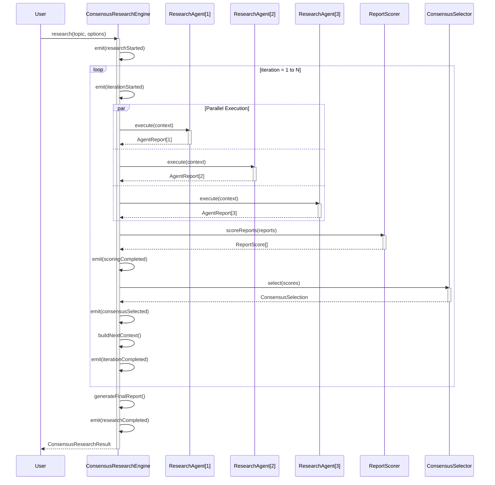
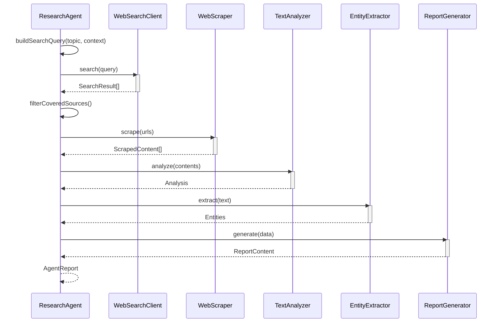
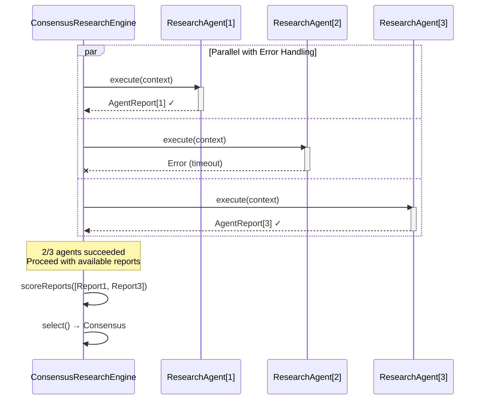
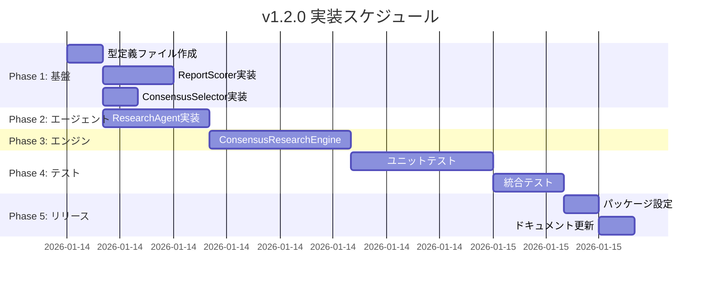

# KATASHIRO v1.2.0 設計ドキュメント

**作成日**: 2026-01-14  
**バージョン**: 1.2.0  
**ステータス**: 設計中  
**関連要件**: [REQ-v1.2.0.md](../specs/REQ-v1.2.0.md)

---

## 1. 概要

### 1.1 目的

本ドキュメントは、KATASHIRO v1.2.0で実装する「反復合議型リサーチワークフロー（Iterative Consensus Research Workflow）」の詳細設計を定義する。

### 1.2 スコープ

| 設計ID | 対応要件 | 概要 |
|--------|----------|------|
| DES-1.2.0-WFL-001 | REQ-1.2.0-WFL-001 | 並列リサーチ実行 |
| DES-1.2.0-WFL-002 | REQ-1.2.0-WFL-002 | 矛盾検出・スコアリング |
| DES-1.2.0-WFL-003 | REQ-1.2.0-WFL-003 | 最良レポート選択 |
| DES-1.2.0-WFL-004 | REQ-1.2.0-WFL-004 | 反復リファインメント |
| DES-1.2.0-WFL-005 | REQ-1.2.0-WFL-005 | 最終レポート生成 |
| DES-1.2.0-AGT-001 | REQ-1.2.0-AGT-001 | リサーチエージェント |
| DES-1.2.0-AGT-002 | REQ-1.2.0-AGT-002 | エージェント多様性 |
| DES-1.2.0-ERR-001 | REQ-1.2.0-ERR-001 | エージェント障害耐性 |
| DES-1.2.0-ERR-002 | REQ-1.2.0-ERR-002 | タイムアウト処理 |
| DES-1.2.0-OBS-001 | REQ-1.2.0-OBS-001 | プログレスイベント |
| DES-1.2.0-OBS-002 | REQ-1.2.0-OBS-002 | 透明性レポート |
| DES-1.2.0-NFR-001 | REQ-1.2.0-NFR-001 | 実行時間 |
| DES-1.2.0-NFR-002 | REQ-1.2.0-NFR-002 | 並列実行 |
| DES-1.2.0-NFR-003 | REQ-1.2.0-NFR-003 | 既存API互換 |

### 1.3 アーキテクチャ概要

```
┌──────────────────────────────────────────────────────────────────────┐
│                        ConsensusResearchEngine                        │
│                         (オーケストレーター)                           │
├──────────────────────────────────────────────────────────────────────┤
│  ┌─────────────┐  ┌─────────────┐  ┌─────────────┐                   │
│  │ResearchAgent│  │ResearchAgent│  │ResearchAgent│  ← 並列実行       │
│  │   (Agent1)  │  │   (Agent2)  │  │   (Agent3)  │                   │
│  └──────┬──────┘  └──────┬──────┘  └──────┬──────┘                   │
│         │                │                │                          │
│         └────────────────┼────────────────┘                          │
│                          ▼                                           │
│                   ┌─────────────┐                                    │
│                   │ReportScorer │  ← スコアリング・矛盾検出          │
│                   └──────┬──────┘                                    │
│                          ▼                                           │
│                   ┌─────────────┐                                    │
│                   │  Consensus  │  ← 最良選択                        │
│                   │  Selector   │                                    │
│                   └─────────────┘                                    │
└──────────────────────────────────────────────────────────────────────┘
                              │
                              ▼
┌──────────────────────────────────────────────────────────────────────┐
│                        Existing KATASHIRO                             │
├──────────────────────────────────────────────────────────────────────┤
│  ┌────────────────┐  ┌────────────┐  ┌──────────────┐               │
│  │ WebSearchClient│  │ WebScraper │  │ TextAnalyzer │               │
│  └────────────────┘  └────────────┘  └──────────────┘               │
│  ┌────────────────┐  ┌────────────┐  ┌──────────────┐               │
│  │EntityExtractor │  │FactChecker │  │ReportGenerator│              │
│  └────────────────┘  └────────────┘  └──────────────┘               │
└──────────────────────────────────────────────────────────────────────┘
```

### 1.4 パッケージ構成

```
packages/
├── orchestrator/              # 新規パッケージ
│   └── src/
│       ├── consensus/
│       │   ├── ConsensusResearchEngine.ts   # メインエンジン
│       │   ├── ResearchAgent.ts             # リサーチエージェント
│       │   ├── ReportScorer.ts              # スコアリング
│       │   ├── ConsensusSelector.ts         # 選択ロジック
│       │   ├── types.ts                     # 型定義
│       │   └── index.ts                     # エクスポート
│       └── index.ts
├── collector/                 # 既存（利用）
├── analyzer/                  # 既存（利用）
├── generator/                 # 既存（利用）
└── katashiro/                 # メインパッケージ（re-export）
```

---

## 2. クラス設計

### 2.1 ConsensusResearchEngine（DES-1.2.0-WFL-001〜005）

#### 2.1.1 クラス図

```
┌─────────────────────────────────────────────────────────────┐
│                  ConsensusResearchEngine                     │
├─────────────────────────────────────────────────────────────┤
│ - config: ConsensusResearchConfig                           │
│ - agents: ResearchAgent[]                                   │
│ - scorer: ReportScorer                                      │
│ - selector: ConsensusSelector                               │
│ - eventEmitter: EventEmitter                                │
├─────────────────────────────────────────────────────────────┤
│ + constructor(config?: Partial<ConsensusResearchConfig>)    │
│ + research(topic: string, options?: ResearchOptions):       │
│     Promise<ConsensusResearchResult>                        │
│ + on(event: string, listener: Function): this               │
│ + off(event: string, listener: Function): this              │
│ - runIteration(context: IterationContext):                  │
│     Promise<IterationResult>                                │
│ - executeAgentsInParallel(context: IterationContext):       │
│     Promise<AgentReport[]>                                  │
│ - scoreReports(reports: AgentReport[]): ReportScore[]       │
│ - selectConsensus(scores: ReportScore[]): ConsensusSelection│
│ - buildNextContext(current: IterationContext,               │
│     consensus: string, score: ReportScore): IterationContext│
│ - generateFinalReport(iterations: IterationResult[]):       │
│     string                                                  │
│ - emit(event: ConsensusResearchEvent): void                 │
└─────────────────────────────────────────────────────────────┘
```

#### 2.1.2 メソッド詳細

##### research() - メインエントリポイント

```typescript
/**
 * 反復合議型リサーチを実行
 * @requirement REQ-1.2.0-WFL-001, REQ-1.2.0-WFL-004, REQ-1.2.0-WFL-005
 * @param topic リサーチトピック
 * @param options オプション設定
 * @returns 最終結果
 */
async research(
  topic: string,
  options?: Partial<ConsensusResearchConfig>
): Promise<ConsensusResearchResult> {
  const startedAt = new Date().toISOString();
  const config = { ...this.config, ...options, topic };
  
  this.emit({ type: 'researchStarted', topic, config });
  
  const iterations: IterationResult[] = [];
  let currentContext: IterationContext = {
    iteration: 1,
    previousConsensus: null,
    previousScore: null,
    unresolvedQuestions: [],
    coveredSources: [],
    areasToDeepen: [],
    isInitial: true,
  };
  
  try {
    for (let i = 1; i <= config.iterationCount; i++) {
      currentContext.iteration = i;
      currentContext.isInitial = (i === 1);
      
      const iterationResult = await this.runIteration(currentContext);
      iterations.push(iterationResult);
      
      // 早期終了判定（AC4: 2連続で改善<5%）
      if (i >= 2 && this.shouldTerminateEarly(iterations)) {
        break;
      }
      
      // 次のコンテキストを構築
      currentContext = this.buildNextContext(
        currentContext,
        iterationResult.consensusReport,
        iterationResult.scores.find(s => s.reportId === iterationResult.selectedReportId)!
      );
    }
    
    const finalReport = this.generateFinalReport(iterations);
    const result: ConsensusResearchResult = {
      finalReport,
      iterations,
      totalDurationMs: Date.now() - new Date(startedAt).getTime(),
      totalAgentRuns: iterations.length * config.agentCount,
      finalScore: iterations[iterations.length - 1].scores[0],
      metadata: { topic, startedAt, completedAt: new Date().toISOString(), config },
    };
    
    this.emit({ type: 'researchCompleted', result });
    return result;
    
  } catch (error) {
    this.emit({ type: 'researchFailed', error: error as Error });
    throw error;
  }
}
```

##### runIteration() - 1イテレーション実行

```typescript
/**
 * 1イテレーションを実行
 * @requirement REQ-1.2.0-WFL-001, REQ-1.2.0-WFL-002, REQ-1.2.0-WFL-003
 */
private async runIteration(context: IterationContext): Promise<IterationResult> {
  const startTime = Date.now();
  
  this.emit({ type: 'iterationStarted', iteration: context.iteration, context });
  
  // 1. エージェント並列実行
  const agentReports = await this.executeAgentsInParallel(context);
  
  // 2. スコアリング
  const scores = this.scorer.scoreReports(agentReports);
  this.emit({ type: 'scoringCompleted', iteration: context.iteration, scores });
  
  // 3. コンセンサス選択
  const selection = this.selector.select(scores);
  const selectedReport = agentReports.find(r => r.reportId === selection.selectedReportId)!;
  
  this.emit({
    type: 'consensusSelected',
    iteration: context.iteration,
    selectedAgentId: selectedReport.agentId,
    reason: selection.reason,
  });
  
  const result: IterationResult = {
    iteration: context.iteration,
    agentReports,
    scores,
    consensusReport: selectedReport.content,
    selectionReason: selection.reason,
    durationMs: Date.now() - startTime,
    selectedReportId: selection.selectedReportId,
  };
  
  this.emit({ type: 'iterationCompleted', iteration: context.iteration, durationMs: result.durationMs });
  
  return result;
}
```

##### executeAgentsInParallel() - 並列エージェント実行

```typescript
/**
 * エージェントを並列実行
 * @requirement REQ-1.2.0-WFL-001, REQ-1.2.0-ERR-001, REQ-1.2.0-ERR-002
 */
private async executeAgentsInParallel(context: IterationContext): Promise<AgentReport[]> {
  const agentPromises = this.agents.map(async (agent, index) => {
    const agentId = index + 1;
    this.emit({
      type: 'agentStarted',
      iteration: context.iteration,
      agentId,
      strategy: agent.strategy,
    });
    
    const startTime = Date.now();
    
    try {
      // タイムアウト付き実行
      const report = await Promise.race([
        agent.execute(context),
        this.createTimeout(this.config.agentTimeoutMs, agentId),
      ]);
      
      this.emit({
        type: 'agentCompleted',
        iteration: context.iteration,
        agentId,
        durationMs: Date.now() - startTime,
        success: true,
      });
      
      return report;
      
    } catch (error) {
      this.emit({
        type: 'agentCompleted',
        iteration: context.iteration,
        agentId,
        durationMs: Date.now() - startTime,
        success: false,
      });
      
      // エラーを記録してnullを返す
      console.error(`Agent ${agentId} failed:`, error);
      return null;
    }
  });
  
  // Promise.allSettledで全エージェントの完了を待つ
  const results = await Promise.allSettled(agentPromises);
  
  // 成功したレポートのみ抽出
  const successfulReports = results
    .filter((r): r is PromiseFulfilledResult<AgentReport | null> => r.status === 'fulfilled')
    .map(r => r.value)
    .filter((r): r is AgentReport => r !== null);
  
  // 障害耐性チェック（AC3: 過半数失敗時はリトライ）
  if (successfulReports.length < Math.ceil(this.agents.length / 2)) {
    throw new Error(`Majority of agents failed (${successfulReports.length}/${this.agents.length})`);
  }
  
  return successfulReports;
}
```

##### shouldTerminateEarly() - 早期終了判定

```typescript
/**
 * 早期終了を判定
 * @requirement REQ-1.2.0-WFL-004 (AC4: 2連続でスコア改善<5%の場合は早期終了)
 */
private shouldTerminateEarly(iterations: IterationResult[]): boolean {
  if (iterations.length < 2) return false;
  
  // 直近2イテレーションのスコア改善率を計算
  const current = iterations[iterations.length - 1];
  const previous = iterations[iterations.length - 2];
  
  const currentBestScore = Math.max(...current.scores.map(s => s.totalScore));
  const previousBestScore = Math.max(...previous.scores.map(s => s.totalScore));
  
  // 改善率 = (今回 - 前回) / 前回 * 100
  const improvementRate = previousBestScore > 0 
    ? ((currentBestScore - previousBestScore) / previousBestScore) * 100
    : 0;
  
  // 5%未満の改善の場合
  if (improvementRate < 5) {
    // さらに前のイテレーションも確認（2連続判定）
    if (iterations.length >= 3) {
      const beforePrevious = iterations[iterations.length - 3];
      const beforePreviousBestScore = Math.max(...beforePrevious.scores.map(s => s.totalScore));
      const previousImprovementRate = beforePreviousBestScore > 0
        ? ((previousBestScore - beforePreviousBestScore) / beforePreviousBestScore) * 100
        : 0;
      
      // 2連続で5%未満なら早期終了
      return previousImprovementRate < 5;
    }
  }
  
  return false;
}
```

##### buildNextContext() - 次イテレーションコンテキスト構築

```typescript
/**
 * 次イテレーションのコンテキストを構築
 * @requirement REQ-1.2.0-WFL-001, REQ-1.2.0-WFL-003
 */
private buildNextContext(
  current: IterationContext,
  consensusReport: string,
  consensusScore: ReportScore
): IterationContext {
  // 1. カバー済みソースを更新
  const newCoveredSources = [
    ...current.coveredSources,
    ...consensusScore.sourceUrls || [],
  ];
  
  // 2. 未解決の質問を抽出（レポート内の「?」や「要検証」から）
  const unresolvedPatterns = [
    /([^。]+\?)/g,                    // 疑問文
    /\[要検証\]([^。]+)/g,            // 要検証ラベル
    /今後の課題[：:]([^。]+)/g,       // 課題セクション
  ];
  const unresolvedQuestions: string[] = [];
  for (const pattern of unresolvedPatterns) {
    const matches = consensusReport.matchAll(pattern);
    for (const match of matches) {
      unresolvedQuestions.push(match[1].trim());
    }
  }
  
  // 3. 深掘りエリアを特定（スコアの低い側面）
  const areasToDeepen: string[] = [];
  if (consensusScore.consistencyScore < 0.7) {
    areasToDeepen.push('情報の整合性確認');
  }
  if (consensusScore.reliabilityScore < 0.7) {
    areasToDeepen.push('信頼性の高いソースからの検証');
  }
  if (consensusScore.coverageScore < 0.7) {
    areasToDeepen.push('調査範囲の拡大');
  }
  
  return {
    iteration: current.iteration + 1,
    previousConsensus: consensusReport,
    previousScore: consensusScore,
    unresolvedQuestions: unresolvedQuestions.slice(0, 5), // 最大5件
    coveredSources: [...new Set(newCoveredSources)],       // 重複除去
    areasToDeepen,
    isInitial: false,
  };
}
```

##### generateFinalReport() - 最終レポート生成

```typescript
/**
 * 最終レポートを生成
 * @requirement REQ-1.2.0-WFL-005
 */
private generateFinalReport(iterations: IterationResult[]): string {
  const finalIteration = iterations[iterations.length - 1];
  const consensusReport = finalIteration.consensusReport;
  
  // エグゼクティブサマリーを生成
  const executiveSummary = this.generateExecutiveSummary(iterations);
  
  // 調査プロセスの要約
  const processOverview = iterations.map((iter, idx) => {
    const bestScore = Math.max(...iter.scores.map(s => s.totalScore));
    return `- **イテレーション ${idx + 1}**: スコア ${(bestScore * 100).toFixed(1)}% (${iter.selectionReason})`;
  }).join('\n');
  
  // 全イテレーションで発見された主要な知見を統合
  const keyFindings = this.extractKeyFindings(iterations);
  
  // 参照ソース一覧
  const allSources = iterations.flatMap(iter => 
    iter.agentReports.flatMap(r => r.sources)
  );
  const uniqueSources = [...new Map(allSources.map(s => [s.url, s])).values()];
  const sourceList = uniqueSources
    .sort((a, b) => b.reliabilityScore - a.reliabilityScore)
    .slice(0, 20)
    .map(s => `- [${s.title}](${s.url}) (信頼度: ${(s.reliabilityScore * 100).toFixed(0)}%)`)
    .join('\n');
  
  return `# 調査レポート

## エグゼクティブサマリー

${executiveSummary}

## 調査プロセス

${processOverview}

## 詳細レポート

${consensusReport}

## 主要な発見

${keyFindings}

## 参照ソース

${sourceList}

---
*Generated by KATASHIRO Consensus Research Engine v1.2.0*
*Total Iterations: ${iterations.length}*
*Final Score: ${(Math.max(...finalIteration.scores.map(s => s.totalScore)) * 100).toFixed(1)}%*
`;
}

/**
 * エグゼクティブサマリーを生成
 */
private generateExecutiveSummary(iterations: IterationResult[]): string {
  const finalScore = Math.max(...iterations[iterations.length - 1].scores.map(s => s.totalScore));
  const initialScore = Math.max(...iterations[0].scores.map(s => s.totalScore));
  const improvement = ((finalScore - initialScore) / initialScore * 100).toFixed(1);
  
  return `本調査は${iterations.length}回の反復合議プロセスを経て完了しました。` +
    `初回スコア${(initialScore * 100).toFixed(1)}%から最終スコア${(finalScore * 100).toFixed(1)}%まで、` +
    `${improvement}%の品質向上を達成しました。`;
}

/**
 * 全イテレーションから主要な発見を抽出
 */
private extractKeyFindings(iterations: IterationResult[]): string {
  const findings: string[] = [];
  
  for (const iter of iterations) {
    // 各イテレーションのコンセンサスレポートから「主要な発見」セクションを抽出
    const findingsMatch = iter.consensusReport.match(/## 主要な発見[\s\S]*?(?=##|$)/);
    if (findingsMatch) {
      findings.push(findingsMatch[0].replace(/## 主要な発見\s*/, '').trim());
    }
  }
  
  // 重複を除去して統合
  const uniqueFindings = [...new Set(findings.flatMap(f => f.split('\n').filter(l => l.trim())))];
  return uniqueFindings.slice(0, 10).join('\n');
}
```

---

### 2.2 ResearchAgent（DES-1.2.0-AGT-001〜002）

#### 2.2.1 クラス図

```
┌─────────────────────────────────────────────────────────────┐
│                      ResearchAgent                           │
├─────────────────────────────────────────────────────────────┤
│ - agentId: number                                           │
│ - strategy: AgentStrategy                                   │
│ - searchClient: WebSearchClient                             │
│ - scraper: WebScraper                                       │
│ - analyzer: TextAnalyzer                                    │
│ - extractor: EntityExtractor                                │
│ - reportGenerator: ReportGenerator                          │
├─────────────────────────────────────────────────────────────┤
│ + constructor(agentId: number, strategy: AgentStrategy)     │
│ + execute(context: IterationContext): Promise<AgentReport>  │
│ + get strategy(): AgentStrategy                             │
│ - search(topic: string, context: IterationContext):         │
│     Promise<SearchResult[]>                                 │
│ - scrape(urls: string[]): Promise<ScrapedContent[]>         │
│ - analyze(contents: ScrapedContent[]): Promise<Analysis>    │
│ - generateReport(analysis: Analysis, sources: Source[]):    │
│     Promise<string>                                         │
│ - buildSearchQuery(topic: string, context: IterationContext):│
│     string                                                  │
└─────────────────────────────────────────────────────────────┘
```

#### 2.2.2 メソッド詳細

##### execute() - リサーチパイプライン実行

```typescript
/**
 * リサーチパイプラインを実行
 * @requirement REQ-1.2.0-AGT-001
 */
async execute(context: IterationContext): Promise<AgentReport> {
  const startTime = Date.now();
  const reportId = `report-${this.agentId}-${context.iteration}-${Date.now()}`;
  
  // 1. 検索クエリ構築（戦略に基づく）
  const query = this.buildSearchQuery(context.topic, context);
  
  // 2. 検索実行
  const searchResults = await this.search(query, context);
  
  // 3. スクレイピング（カバー済みソースを除外）
  const urlsToScrape = searchResults
    .map(r => r.url)
    .filter(url => !context.coveredSources.includes(url))
    .slice(0, this.strategy.maxResultsPerAgent || 5);
  
  const scrapedContents = await this.scrape(urlsToScrape);
  
  // 4. 分析
  const analysis = await this.analyze(scrapedContents);
  
  // 5. エンティティ抽出
  const entities = await this.extractor.extract(
    scrapedContents.map(c => c.content).join('\n\n')
  );
  
  // 6. レポート生成
  const reportContent = await this.generateReport(analysis, scrapedContents, entities, context);
  
  // 7. ソース参照情報を構築
  const sources: SourceReference[] = scrapedContents.map(c => ({
    url: c.url,
    title: c.title || c.url,
    fetchedAt: new Date().toISOString(),
    reliabilityScore: this.estimateSourceReliability(c.url),
  }));
  
  return {
    agentId: this.agentId,
    reportId,
    content: reportContent,
    sources,
    strategy: this.strategy,
    generatedAt: new Date().toISOString(),
    durationMs: Date.now() - startTime,
  };
}

/**
 * ソースURLから信頼性スコアを推定
 * @requirement REQ-1.2.0-WFL-002
 */
private estimateSourceReliability(url: string): number {
  const domain = new URL(url).hostname.toLowerCase();
  
  // 公式・政府系（高信頼）
  if (/\.gov(\.[a-z]{2})?$|\.go\.jp$/.test(domain)) return 0.95;
  
  // 学術系（高信頼）
  if (/\.edu(\.[a-z]{2})?$|\.ac\.jp$/.test(domain)) return 0.90;
  
  // 大手ニュースメディア（中〜高信頼）
  const trustedNews = ['reuters.com', 'bloomberg.com', 'nikkei.com', 'nhk.or.jp', 'bbc.com'];
  if (trustedNews.some(d => domain.includes(d))) return 0.85;
  
  // 公式企業サイト（中信頼）
  if (/\.co\.jp$|\.com$/.test(domain) && !domain.includes('blog')) return 0.70;
  
  // ブログ・個人サイト（低〜中信頼）
  if (/blog|note\.com|qiita\.com|zenn\.dev/.test(domain)) return 0.50;
  
  // その他（デフォルト）
  return 0.60;
}
```

##### buildSearchQuery() - 戦略に基づくクエリ構築

```typescript
/**
 * エージェント戦略に基づいて検索クエリを構築
 * @requirement REQ-1.2.0-AGT-002
 */
private buildSearchQuery(topic: string, context: IterationContext): string {
  const modifiers = this.strategy.queryModifiers;
  
  // 初回イテレーションは広範な検索
  if (context.isInitial) {
    return `${topic} ${modifiers.join(' ')}`;
  }
  
  // 2回目以降は深掘りエリアにフォーカス
  const focusArea = context.areasToDeepen[this.agentId % context.areasToDeepen.length] || '';
  return `${topic} ${focusArea} ${modifiers.join(' ')}`;
}
```

---

### 2.3 ReportScorer（DES-1.2.0-WFL-002）

#### 2.3.1 クラス図

```
┌─────────────────────────────────────────────────────────────┐
│                       ReportScorer                           │
├─────────────────────────────────────────────────────────────┤
│ - factChecker: FactChecker                                  │
│ - conflictThreshold: number                                 │
├─────────────────────────────────────────────────────────────┤
│ + constructor(conflictThreshold?: number)                   │
│ + scoreReports(reports: AgentReport[]): ReportScore[]       │
│ + scoreReport(report: AgentReport,                          │
│     allReports: AgentReport[]): ReportScore                 │
│ - calculateConsistencyScore(report: AgentReport,            │
│     conflicts: ConflictDetail[]): number                    │
│ - calculateReliabilityScore(sources: SourceReference[]):    │
│     number                                                  │
│ - calculateCoverageScore(report: AgentReport): number       │
│ - detectConflicts(report: AgentReport,                      │
│     otherReports: AgentReport[]): ConflictDetail[]          │
└─────────────────────────────────────────────────────────────┘
```

#### 2.3.2 スコアリングアルゴリズム

```typescript
/**
 * レポートをスコアリング
 * @requirement REQ-1.2.0-WFL-002
 */
scoreReport(report: AgentReport, allReports: AgentReport[]): ReportScore {
  // 1. 矛盾検出
  const otherReports = allReports.filter(r => r.reportId !== report.reportId);
  const conflicts = this.detectConflicts(report, otherReports);
  
  // 2. 一貫性スコア（矛盾が少ないほど高い）
  const consistencyScore = this.calculateConsistencyScore(report, conflicts);
  
  // 3. ソース信頼性スコア
  const reliabilityScore = this.calculateReliabilityScore(report.sources);
  
  // 4. カバレッジスコア
  const coverageScore = this.calculateCoverageScore(report);
  
  // 5. 総合スコア計算
  // Score = (ConsistencyScore * 0.5) + (ReliabilityScore * 0.3) + (CoverageScore * 0.2)
  const totalScore = 
    (consistencyScore * 0.5) +
    (reliabilityScore * 0.3) +
    (coverageScore * 0.2);
  
  // 6. ソースURL一覧を抽出
  const sourceUrls = report.sources.map(s => s.url);
  
  return {
    reportId: report.reportId,
    consistencyScore,
    reliabilityScore,
    coverageScore,
    totalScore,
    conflicts,
    unverifiedCount: this.countUnverifiedStatements(report),
    sourceUrls,
  };
}

/**
 * 一貫性スコアを計算
 * 矛盾の数と深刻度に基づいて減点
 */
private calculateConsistencyScore(report: AgentReport, conflicts: ConflictDetail[]): number {
  if (conflicts.length === 0) return 1.0;
  
  // 深刻度に応じた減点
  const totalPenalty = conflicts.reduce((sum, c) => {
    const severityWeight = c.severity / 5; // 1-5 → 0.2-1.0
    const confidenceWeight = c.confidence;
    return sum + (severityWeight * confidenceWeight * 0.1);
  }, 0);
  
  return Math.max(0, 1.0 - totalPenalty);
}

/**
 * ソース信頼性スコアを計算
 */
private calculateReliabilityScore(sources: SourceReference[]): number {
  if (sources.length === 0) return 0;
  
  const avgReliability = sources.reduce((sum, s) => sum + (s.reliabilityScore || 0.5), 0) / sources.length;
  return avgReliability;
}

/**
 * カバレッジスコアを計算
 * レポートの情報網羅度を評価
 */
private calculateCoverageScore(report: AgentReport): number {
  const content = report.content;
  
  // 評価基準
  const metrics = {
    // ソース数（多いほど良い、最大10で1.0）
    sourceCount: Math.min(report.sources.length / 10, 1.0),
    // コンテンツ長（適度な長さが良い、2000-5000文字で最高）
    contentLength: this.normalizeContentLength(content.length),
    // セクション数（構造化されているほど良い）
    sectionCount: (content.match(/^#{1,3}\s/gm) || []).length / 10,
    // エンティティ多様性（人名、組織名、日付などの種類）
    entityDiversity: this.estimateEntityDiversity(content),
  };
  
  // 重み付き平均
  return (
    metrics.sourceCount * 0.3 +
    metrics.contentLength * 0.2 +
    metrics.sectionCount * 0.2 +
    metrics.entityDiversity * 0.3
  );
}

private normalizeContentLength(length: number): number {
  if (length < 1000) return length / 1000;
  if (length <= 5000) return 1.0;
  if (length <= 10000) return 1.0 - (length - 5000) / 10000;
  return 0.5;
}

private estimateEntityDiversity(content: string): number {
  const patterns = [
    /\d{4}年/g,           // 年
    /[A-Z][a-z]+/g,       // 固有名詞（英語）
    /「[^」]+」/g,         // 引用
    /https?:\/\/[^\s]+/g, // URL
  ];
  
  let diversityScore = 0;
  for (const pattern of patterns) {
    const matches = content.match(pattern);
    if (matches && matches.length > 0) {
      diversityScore += Math.min(matches.length / 5, 0.25);
    }
  }
  
  return Math.min(diversityScore, 1.0);
}

/**
 * 未検証ステートメントをカウント
 */
private countUnverifiedStatements(report: AgentReport): number {
  // [要検証] や [未確認] などのラベルをカウント
  const unverifiedPatterns = [
    /\[要検証\]/g,
    /\[未確認\]/g,
    /\[unverified\]/gi,
    /（要確認）/g,
  ];
  
  let count = 0;
  for (const pattern of unverifiedPatterns) {
    const matches = report.content.match(pattern);
    if (matches) count += matches.length;
  }
  
  return count;
}
```

---

### 2.4 ConsensusSelector（DES-1.2.0-WFL-003）

#### 2.4.1 クラス図

```
┌─────────────────────────────────────────────────────────────┐
│                    ConsensusSelector                         │
├─────────────────────────────────────────────────────────────┤
│ （ステートレス）                                              │
├─────────────────────────────────────────────────────────────┤
│ + select(scores: ReportScore[]): ConsensusSelection         │
│ - generateReason(selected: ReportScore,                     │
│     others: ReportScore[]): string                          │
└─────────────────────────────────────────────────────────────┘

interface ConsensusSelection {
  selectedReportId: string;
  reason: string;
}
```

#### 2.4.2 選択ロジック

```typescript
/**
 * 最良レポートを選択
 * @requirement REQ-1.2.0-WFL-003
 */
select(scores: ReportScore[]): ConsensusSelection {
  if (scores.length === 0) {
    throw new Error('No reports to select from');
  }
  
  if (scores.length === 1) {
    return {
      selectedReportId: scores[0].reportId,
      reason: 'Only one report available',
    };
  }
  
  // 総合スコアでソート（降順）
  const sorted = [...scores].sort((a, b) => b.totalScore - a.totalScore);
  const best = sorted[0];
  const secondBest = sorted[1];
  
  // タイブレーカー: 同スコアの場合はconsistencyで判断
  if (Math.abs(best.totalScore - secondBest.totalScore) < 0.01) {
    const byConsistency = [...scores].sort((a, b) => b.consistencyScore - a.consistencyScore);
    return {
      selectedReportId: byConsistency[0].reportId,
      reason: `Tie-breaker: highest consistency score (${byConsistency[0].consistencyScore.toFixed(3)})`,
    };
  }
  
  return {
    selectedReportId: best.reportId,
    reason: this.generateReason(best, sorted.slice(1)),
  };
}

private generateReason(selected: ReportScore, others: ReportScore[]): string {
  const avgOthers = others.reduce((sum, s) => sum + s.totalScore, 0) / others.length;
  const margin = ((selected.totalScore - avgOthers) * 100).toFixed(1);
  
  return `Selected with total score ${selected.totalScore.toFixed(3)} ` +
    `(+${margin}% vs average). ` +
    `Consistency: ${selected.consistencyScore.toFixed(3)}, ` +
    `Reliability: ${selected.reliabilityScore.toFixed(3)}, ` +
    `Coverage: ${selected.coverageScore.toFixed(3)}. ` +
    `Conflicts: ${selected.conflicts.length}`;
}
```

---

## 3. シーケンス図

### 3.1 メインフロー



### 3.2 エージェント実行フロー



### 3.3 エラーハンドリングフロー



---

## 4. 型定義詳細

### 4.1 設定型

```typescript
// packages/orchestrator/src/consensus/types.ts

/**
 * 合議型リサーチ設定
 */
export interface ConsensusResearchConfig {
  /** リサーチトピック */
  topic: string;
  /** 並列エージェント数（デフォルト: 3） */
  agentCount: number;
  /** イテレーション数（デフォルト: 3） */
  iterationCount: number;
  /** エージェントタイムアウト（ミリ秒、デフォルト: 300000） */
  agentTimeoutMs: number;
  /** 矛盾許容閾値（0-1、デフォルト: 0.1） */
  conflictThreshold: number;
  /** 検索プロバイダー設定 */
  searchConfig: {
    provider: 'duckduckgo' | 'searxng';
    maxResultsPerAgent: number;
  };
  /** 早期終了閾値（デフォルト: 0.05） */
  earlyTerminationThreshold: number;
}

/**
 * デフォルト設定
 */
export const DEFAULT_CONFIG: ConsensusResearchConfig = {
  topic: '',
  agentCount: 3,
  iterationCount: 3,
  agentTimeoutMs: 300000, // 5分
  conflictThreshold: 0.1,
  searchConfig: {
    provider: 'duckduckgo',
    maxResultsPerAgent: 10,
  },
  earlyTerminationThreshold: 0.05,
};
```

### 4.2 エージェント戦略型

```typescript
/**
 * エージェント戦略
 */
export interface AgentStrategy {
  /** エージェントID */
  agentId: number;
  /** 検索クエリ修飾子 */
  queryModifiers: string[];
  /** 優先ソースタイプ */
  preferredSources: SourceType[];
  /** 時間範囲フィルタ */
  timeRange: 'day' | 'week' | 'month' | 'year' | 'all';
  /** 1エージェントあたりの最大結果数 */
  maxResultsPerAgent: number;
}

export type SourceType = 'official' | 'news' | 'academic' | 'community';

/**
 * デフォルトエージェント戦略
 */
export const DEFAULT_STRATEGIES: AgentStrategy[] = [
  {
    agentId: 1,
    queryModifiers: ['公式', '発表', 'オフィシャル'],
    preferredSources: ['official'],
    timeRange: 'all',
    maxResultsPerAgent: 10,
  },
  {
    agentId: 2,
    queryModifiers: ['最新', 'ニュース', '速報'],
    preferredSources: ['news'],
    timeRange: 'week',
    maxResultsPerAgent: 10,
  },
  {
    agentId: 3,
    queryModifiers: ['分析', '考察', '懸念', '課題'],
    preferredSources: ['academic', 'community'],
    timeRange: 'month',
    maxResultsPerAgent: 10,
  },
];
```

### 4.3 コンテキスト型

```typescript
/**
 * イテレーションコンテキスト
 */
export interface IterationContext {
  /** イテレーション番号（1-based） */
  iteration: number;
  /** 前回のコンセンサスレポート */
  previousConsensus: string | null;
  /** 前回のスコア */
  previousScore: ReportScore | null;
  /** 未解決の疑問点 */
  unresolvedQuestions: string[];
  /** カバー済みソース（URL） */
  coveredSources: string[];
  /** 深掘りが必要なエリア */
  areasToDeepen: string[];
  /** 初回イテレーションフラグ */
  isInitial: boolean;
  /** トピック（便宜的に追加） */
  topic?: string;
}
```

### 4.4 結果型

```typescript
/**
 * レポートスコア
 */
export interface ReportScore {
  reportId: string;
  consistencyScore: number;
  reliabilityScore: number;
  coverageScore: number;
  totalScore: number;
  conflicts: ConflictDetail[];
  unverifiedCount: number;
  sourceUrls?: string[];
}

/**
 * 矛盾詳細
 */
export interface ConflictDetail {
  conflictId: string;
  type: 'contradiction' | 'inconsistency' | 'outdated';
  statement1: { text: string; source: string; reportId: string };
  statement2: { text: string; source: string; reportId: string };
  severity: number; // 1-5
  confidence: number; // 0-1
  resolution?: string;
}

/**
 * エージェントレポート
 */
export interface AgentReport {
  agentId: number;
  reportId: string;
  content: string;
  sources: SourceReference[];
  strategy: AgentStrategy;
  generatedAt: string;
  durationMs: number;
}

/**
 * ソース参照
 */
export interface SourceReference {
  url: string;
  title: string;
  fetchedAt: string;
  reliabilityScore?: number;
}

/**
 * イテレーション結果
 */
export interface IterationResult {
  iteration: number;
  agentReports: AgentReport[];
  scores: ReportScore[];
  consensusReport: string;
  selectionReason: string;
  durationMs: number;
  selectedReportId: string;
}

/**
 * 最終結果
 */
export interface ConsensusResearchResult {
  finalReport: string;
  iterations: IterationResult[];
  totalDurationMs: number;
  totalAgentRuns: number;
  finalScore: ReportScore;
  metadata: {
    topic: string;
    startedAt: string;
    completedAt: string;
    config: ConsensusResearchConfig;
  };
}
```

### 4.5 イベント型

```typescript
/**
 * 合議型リサーチイベント
 */
export type ConsensusResearchEvent =
  | { type: 'researchStarted'; topic: string; config: ConsensusResearchConfig }
  | { type: 'iterationStarted'; iteration: number; context: IterationContext }
  | { type: 'agentStarted'; iteration: number; agentId: number; strategy: AgentStrategy }
  | { type: 'agentCompleted'; iteration: number; agentId: number; durationMs: number; success: boolean }
  | { type: 'scoringCompleted'; iteration: number; scores: ReportScore[] }
  | { type: 'consensusSelected'; iteration: number; selectedAgentId: number; reason: string }
  | { type: 'iterationCompleted'; iteration: number; durationMs: number }
  | { type: 'researchCompleted'; result: ConsensusResearchResult }
  | { type: 'researchFailed'; error: Error };

/**
 * イベントリスナー型
 */
export type ConsensusResearchEventListener = (event: ConsensusResearchEvent) => void;
```

---

## 5. エラーハンドリング設計

### 5.1 障害耐性（DES-1.2.0-ERR-001）

```typescript
/**
 * エージェント障害時の処理
 */
class ConsensusResearchEngine {
  private async handleAgentFailure(
    agentId: number,
    error: Error,
    context: IterationContext
  ): Promise<void> {
    console.error(`Agent ${agentId} failed in iteration ${context.iteration}:`, error);
    
    // エラー詳細をログ
    this.emit({
      type: 'agentCompleted',
      iteration: context.iteration,
      agentId,
      durationMs: 0,
      success: false,
    });
  }
  
  /**
   * 過半数失敗時のリトライロジック
   */
  private async retryIteration(context: IterationContext): Promise<AgentReport[]> {
    console.warn(`Retrying iteration ${context.iteration} due to majority failure`);
    
    // 1回のみリトライ
    const retryReports = await this.executeAgentsInParallel(context);
    
    if (retryReports.length < Math.ceil(this.agents.length / 2)) {
      throw new Error(
        `Iteration ${context.iteration} failed after retry: ` +
        `${retryReports.length}/${this.agents.length} agents succeeded`
      );
    }
    
    return retryReports;
  }
}
```

### 5.2 タイムアウト処理（DES-1.2.0-ERR-002）

```typescript
/**
 * タイムアウトPromiseを作成
 */
private createTimeout(ms: number, agentId: number): Promise<never> {
  return new Promise((_, reject) => {
    setTimeout(() => {
      reject(new Error(`Agent ${agentId} timed out after ${ms}ms`));
    }, ms);
  });
}

/**
 * AbortControllerを使用したキャンセル可能な実行
 */
private async executeWithAbort(
  agent: ResearchAgent,
  context: IterationContext,
  signal: AbortSignal
): Promise<AgentReport> {
  // AbortSignalを監視しながら実行
  return agent.execute(context, signal);
}
```

---

## 6. 実装計画

### 6.1 タスク分解

| タスクID | 概要 | 依存 | 見積 |
|----------|------|------|------|
| TSK-1.2.0-001 | 型定義ファイル作成 | - | 2h |
| TSK-1.2.0-002 | ReportScorer実装 | TSK-001 | 4h |
| TSK-1.2.0-003 | ConsensusSelector実装 | TSK-001 | 2h |
| TSK-1.2.0-004 | ResearchAgent実装 | TSK-001 | 6h |
| TSK-1.2.0-005 | ConsensusResearchEngine実装 | TSK-002,003,004 | 8h |
| TSK-1.2.0-006 | ユニットテスト（型・スコアリング） | TSK-001,002 | 4h |
| TSK-1.2.0-007 | ユニットテスト（エージェント） | TSK-004 | 4h |
| TSK-1.2.0-008 | 統合テスト | TSK-005 | 4h |
| TSK-1.2.0-009 | パッケージエクスポート設定 | TSK-005 | 2h |
| TSK-1.2.0-010 | ドキュメント更新 | TSK-009 | 2h |

### 6.2 実装順序



---

## 7. 改訂履歴

| バージョン | 日付 | 変更内容 | 著者 |
|-----------|------|---------|------|
| 0.1 | 2026-01-14 | 初版作成 | KATASHIRO |
| 0.2 | 2026-01-14 | 設計レビュー対応: REV-D01〜D06の修正（shouldTerminateEarly, generateFinalReport, buildNextContext, calculateCoverageScore, estimateSourceReliability, countUnverifiedStatements メソッド追加） | KATASHIRO |
| 0.3 | 2026-01-14 | 設計レビュー対応: REV-D08〜D10の修正（overallScore→totalScore統一、sourceReliabilityScore→reliabilityScore統一、sourceUrls追加） | KATASHIRO |

---

## 8. 承認

| 役割 | 名前 | 日付 | 署名 |
|------|------|------|------|
| 作成者 | KATASHIRO Agent | 2026-01-14 | ✅ |
| レビュー | - | - | ⏳ 未完了 |
| 承認 | - | - | ⏳ 未完了 |
