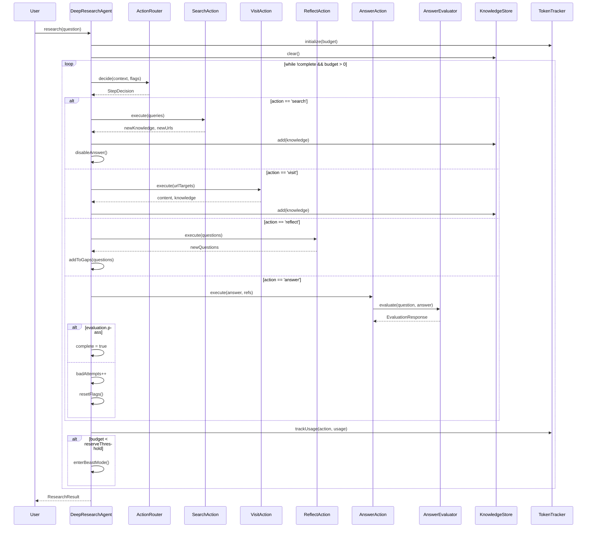

# KATASHIRO v2.1.0 設計ドキュメント - DeepResearchAgent

## 1. 概要

`DeepResearchAgent`は、jina-ai/node-DeepResearchのアーキテクチャを参考にした新しいDeep Researchエンジンです。
既存の`DeepResearchOrchestrator`を拡張し、より柔軟なマルチアクションシステムを実装します。

---

## 2. アーキテクチャ

```
┌─────────────────────────────────────────────────────────────────┐
│                      DeepResearchAgent                          │
├─────────────────────────────────────────────────────────────────┤
│  ┌──────────────┐ ┌──────────────┐ ┌──────────────┐            │
│  │ ActionRouter │ │ StepPlanner  │ │ TokenTracker │            │
│  └──────────────┘ └──────────────┘ └──────────────┘            │
│          │               │                │                     │
│  ┌───────┴───────┬───────┴───────┬────────┴───────┐            │
│  │               │               │                │            │
│  ▼               ▼               ▼                ▼            │
│ ┌────┐ ┌────┐ ┌────────┐ ┌────────┐ ┌────────┐                 │
│ │Search│ │Visit│ │Reflect │ │ Answer │ │ Coding │               │
│ │Action│ │Action│ │Action │ │Action │ │Action │                 │
│ └────┘ └────┘ └────────┘ └────────┘ └────────┘                 │
│    │      │        │          │          │                      │
│    └──────┴────────┴──────────┴──────────┘                      │
│                    │                                             │
│              ┌─────▼─────┐                                       │
│              │ Knowledge │                                       │
│              │   Store   │                                       │
│              └───────────┘                                       │
│                    │                                             │
│              ┌─────▼─────┐                                       │
│              │ Evaluator │                                       │
│              └───────────┘                                       │
└─────────────────────────────────────────────────────────────────┘
```

---

## 3. クラス設計

### 3.1 DeepResearchAgent

```typescript
// packages/analyzer/src/research/agent/DeepResearchAgent.ts

import { EventEmitter } from 'events';

export interface DeepResearchConfig {
  // トークン予算
  tokenBudget: number;              // デフォルト: 1_000_000
  reserveFinalRatio: number;        // 最終回答リザーブ: 0.15
  
  // 試行回数制限
  maxBadAttempts: number;           // デフォルト: 3
  maxSteps: number;                 // デフォルト: 50
  
  // 検索設定
  searchProvider: SearchProvider;
  maxQueriesPerStep: number;        // デフォルト: 3
  maxUrlsPerStep: number;           // デフォルト: 5
  
  // 評価設定
  minRelevanceScore: number;        // デフォルト: 0.80
  maxReferences: number;            // デフォルト: 10
  
  // チームリサーチ
  teamSize: number;                 // デフォルト: 1（無効）
  
  // 言語設定
  languageCode?: string;
  searchLanguageCode?: string;
}

export class DeepResearchAgent extends EventEmitter {
  private tokenTracker: TokenTracker;
  private actionTracker: ActionTracker;
  private knowledgeStore: KnowledgeStore;
  private evaluator: AnswerEvaluator;
  private queryRewriter: QueryRewriter;
  
  constructor(config?: Partial<DeepResearchConfig>);
  
  /**
   * リサーチを実行
   */
  async research(
    question: string,
    options?: ResearchOptions
  ): Promise<ResearchResult>;
  
  /**
   * ストリーミング実行
   */
  async *researchStream(
    question: string,
    options?: ResearchOptions
  ): AsyncGenerator<ResearchStep, ResearchResult>;
}
```

### 3.2 ActionRouter

```typescript
// packages/analyzer/src/research/agent/ActionRouter.ts

export interface ActionFlags {
  allowSearch: boolean;
  allowVisit: boolean;
  allowReflect: boolean;
  allowAnswer: boolean;
  allowCoding: boolean;
}

export interface ActionContext {
  question: string;
  currentQuestion: string;
  knowledge: KnowledgeItem[];
  urlList: WeightedUrl[];
  diaryContext: string[];
  previousSteps: StepAction[];
}

export class ActionRouter {
  /**
   * 次のアクションを決定
   */
  async decide(
    context: ActionContext,
    flags: ActionFlags
  ): Promise<StepDecision>;
  
  /**
   * システムプロンプトを生成
   */
  private buildSystemPrompt(
    context: ActionContext,
    flags: ActionFlags
  ): string;
}
```

### 3.3 アクションハンドラー

```typescript
// packages/analyzer/src/research/agent/actions/

// 基底インターフェース
export interface ActionHandler<T extends ActionType> {
  readonly type: T;
  canExecute(flags: ActionFlags): boolean;
  execute(params: ActionParams[T], context: ActionContext): Promise<ActionResult>;
}

// SearchAction
export class SearchActionHandler implements ActionHandler<'search'> {
  async execute(params: { searchQueries: string[] }, context: ActionContext): Promise<{
    newKnowledge: KnowledgeItem[];
    newUrls: WeightedUrl[];
    searchedQueries: string[];
  }>;
}

// VisitAction
export class VisitActionHandler implements ActionHandler<'visit'> {
  async execute(params: { urlTargets: number[] }, context: ActionContext): Promise<{
    content: WebContent[];
    newKnowledge: KnowledgeItem[];
  }>;
}

// ReflectAction
export class ReflectActionHandler implements ActionHandler<'reflect'> {
  async execute(params: { questions: string[] }, context: ActionContext): Promise<{
    newQuestions: string[];
    gapAnalysis: GapAnalysis;
  }>;
}

// AnswerAction
export class AnswerActionHandler implements ActionHandler<'answer'> {
  async execute(params: { answer: string; references: Reference[] }, context: ActionContext): Promise<{
    evaluation: EvaluationResponse;
    isFinal: boolean;
  }>;
}

// CodingAction
export class CodingActionHandler implements ActionHandler<'coding'> {
  async execute(params: { codingIssue: string }, context: ActionContext): Promise<{
    result: CodeExecutionResult;
  }>;
}
```

### 3.4 KnowledgeStore

```typescript
// packages/analyzer/src/research/agent/KnowledgeStore.ts

export interface KnowledgeItem {
  id: string;
  question: string;
  answer: string;
  references?: string[];
  type: 'url' | 'side-info' | 'user-provided' | 'computed';
  updated: string;
  confidence: number;
}

export class KnowledgeStore {
  private items: Map<string, KnowledgeItem>;
  
  add(item: Omit<KnowledgeItem, 'id'>): string;
  get(id: string): KnowledgeItem | undefined;
  getAll(): KnowledgeItem[];
  search(query: string): KnowledgeItem[];
  toMessages(): Message[];
  clear(): void;
}
```

### 3.5 AnswerEvaluator

```typescript
// packages/analyzer/src/research/agent/AnswerEvaluator.ts

export type EvaluationType =
  | 'definitive'
  | 'freshness'
  | 'plurality'
  | 'completeness'
  | 'attribution';

export interface EvaluationResponse {
  pass: boolean;
  think: string;
  type?: EvaluationType;
  freshnessAnalysis?: {
    daysAgo: number;
    maxAgeDays?: number;
  };
  pluralityAnalysis?: {
    minimumCountRequired: number;
    actualCountProvided: number;
  };
  completenessAnalysis?: {
    aspectsExpected: string;
    aspectsProvided: string;
  };
  improvementPlan?: string;
}

export class AnswerEvaluator {
  /**
   * 回答を評価
   */
  async evaluate(
    question: string,
    answer: string,
    references: Reference[],
    knowledge: KnowledgeItem[]
  ): Promise<EvaluationResponse>;
  
  /**
   * 質問タイプを分析
   */
  async analyzeQuestion(question: string): Promise<EvaluationType[]>;
}
```

### 3.6 TokenTracker

```typescript
// packages/analyzer/src/research/agent/TokenTracker.ts

export interface TokenUsage {
  promptTokens: number;
  completionTokens: number;
  totalTokens: number;
}

export class TokenTracker {
  private budget: number;
  private usage: Map<string, number>;
  
  constructor(budget: number);
  
  trackUsage(tool: string, usage: TokenUsage): void;
  getTotalUsage(): number;
  getRemainingBudget(): number;
  getBreakdown(): Record<string, number>;
  isExceeded(): boolean;
  getUsageRatio(): number;
}
```

### 3.7 QueryRewriter

```typescript
// packages/analyzer/src/research/agent/QueryRewriter.ts

export interface RewrittenQuery {
  q: string;
  tbs?: 'qdr:h' | 'qdr:d' | 'qdr:w' | 'qdr:m' | 'qdr:y';
  location?: string;
}

export interface IntentAnalysis {
  surface: string;
  practical: string;
  emotional?: string;
  social?: string;
  identity?: string;
}

export class QueryRewriter {
  /**
   * クエリを拡張・改善
   */
  async rewrite(
    query: string,
    context: string,
    previousQueries: string[]
  ): Promise<RewrittenQuery[]>;
  
  /**
   * 意図を分析
   */
  async analyzeIntent(query: string): Promise<IntentAnalysis>;
}
```

---

## 4. 型定義

```typescript
// packages/analyzer/src/research/agent/types.ts

export type ActionType = 'search' | 'visit' | 'reflect' | 'answer' | 'coding';

export interface StepDecision {
  think: string;
  action: ActionType;
  params: ActionParams[ActionType];
}

export interface ActionParams {
  search: { searchQueries: string[] };
  visit: { urlTargets: number[] };
  reflect: { questions: string[] };
  answer: { answer: string; references: Reference[] };
  coding: { codingIssue: string };
}

export interface StepAction extends StepDecision {
  stepNumber: number;
  timestamp: string;
  tokenUsage: TokenUsage;
  result?: ActionResult;
}

export interface Reference {
  url: string;
  title: string;
  exactQuote?: string;
  dateTime?: string;
  relevanceScore?: number;
}

export interface WeightedUrl {
  url: string;
  title: string;
  snippet: string;
  weight: number;
  source: string;
}

export interface ResearchResult {
  answer: string;
  references: Reference[];
  knowledge: KnowledgeItem[];
  steps: StepAction[];
  tokenUsage: TokenUsage;
  completionReason: 'answered' | 'budget_exceeded' | 'max_attempts' | 'max_steps';
}

export interface ResearchStep {
  stepNumber: number;
  action: ActionType;
  think: string;
  status: 'executing' | 'completed' | 'failed';
  details?: string;
}
```

---

## 5. シーケンス図



---

## 6. ディレクトリ構造

```
packages/analyzer/src/research/
├── agent/
│   ├── index.ts
│   ├── DeepResearchAgent.ts
│   ├── ActionRouter.ts
│   ├── KnowledgeStore.ts
│   ├── AnswerEvaluator.ts
│   ├── TokenTracker.ts
│   ├── QueryRewriter.ts
│   ├── types.ts
│   └── actions/
│       ├── index.ts
│       ├── SearchActionHandler.ts
│       ├── VisitActionHandler.ts
│       ├── ReflectActionHandler.ts
│       ├── AnswerActionHandler.ts
│       └── CodingActionHandler.ts
├── DeepResearchOrchestrator.ts  # 既存（互換性維持）
├── GapAnalyzer.ts
├── ConvergenceDetector.ts
├── QueryGenerator.ts
├── FindingIntegrator.ts
└── types.ts
```

---

## 7. 互換性

### 7.1 既存APIとの関係

```typescript
// 既存のDeepResearchOrchestratorは維持
// 新しいDeepResearchAgentを追加

// 推奨: 新しいAPI
import { DeepResearchAgent } from '@nahisaho/katashiro';
const agent = new DeepResearchAgent();
const result = await agent.research('What is AI ethics?');

// レガシー: 引き続き利用可能
import { DeepResearchOrchestrator } from '@nahisaho/katashiro';
const orchestrator = new DeepResearchOrchestrator();
for await (const progress of orchestrator.research({ topic: 'AI ethics' })) {
  // ...
}
```

### 7.2 移行ガイド

| 旧API | 新API |
|-------|-------|
| `DeepResearchOrchestrator.research()` | `DeepResearchAgent.researchStream()` |
| `WideResearchEngine.research()` | 内部で使用（変更なし） |
| `ConsensusResearchEngine.research()` | `teamSize > 1`で自動使用 |

---

## 8. テスト計画

### 8.1 ユニットテスト

- `ActionRouter.test.ts`: アクション選択ロジック
- `KnowledgeStore.test.ts`: 知識の追加・検索
- `AnswerEvaluator.test.ts`: 回答評価
- `TokenTracker.test.ts`: トークン追跡
- `QueryRewriter.test.ts`: クエリ拡張

### 8.2 統合テスト

- `DeepResearchAgent.integration.test.ts`: E2Eフロー
- `ActionHandlers.integration.test.ts`: 各アクションの実行

### 8.3 E2Eテスト

- 実際の検索APIを使用したテスト（モック可能）
- 複雑な質問に対する回答品質テスト
