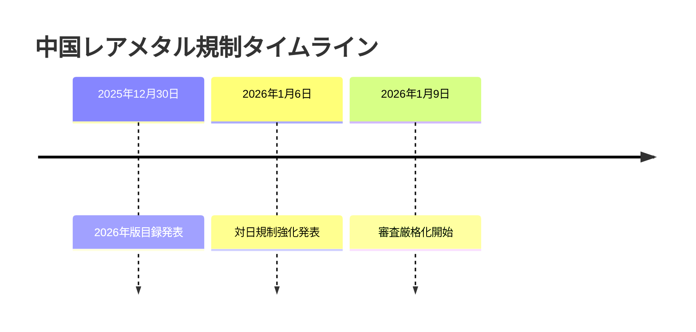
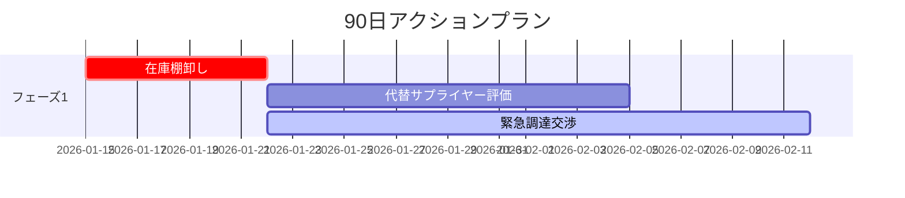
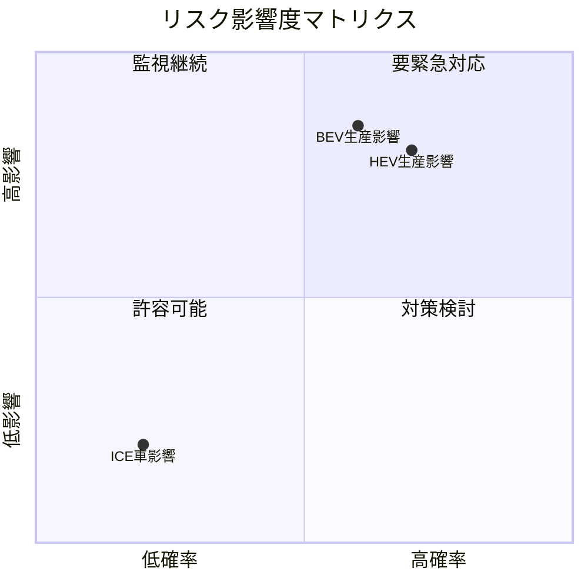
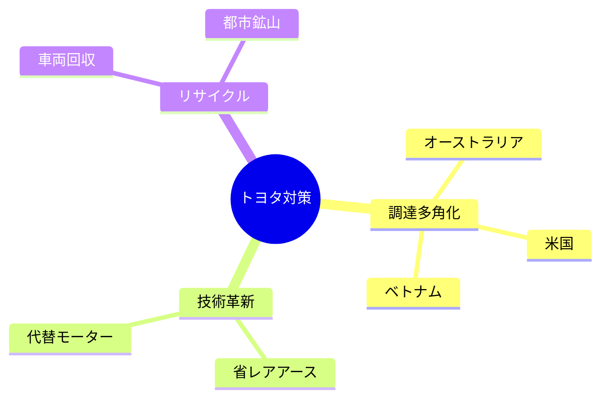

# KATASHIRO v1.1.0 要件定義書（EARS形式）

**作成日**: 2026-01-14  
**バージョン**: 1.1.0  
**ステータス**: レビュー完了  
**要件形式**: EARS (Easy Approach to Requirements Syntax)

---

## 1. 概要

### 1.1 目的

本ドキュメントは、KATASHIRO v1.1.0で実装すべき機能をEARS形式で定義する。

### 1.2 EARS パターン凡例

| パターン | 構文 | 用途 |
|----------|------|------|
| **Ubiquitous** | The [system] SHALL [action] | 常に適用される要件 |
| **Event-driven** | WHEN [event], the [system] SHALL [action] | イベント発生時の要件 |
| **State-driven** | WHILE [state], the [system] SHALL [action] | 特定状態での要件 |
| **Optional** | WHERE [feature], the [system] SHALL [action] | オプション機能の要件 |
| **Unwanted** | IF [condition], THEN the [system] SHALL [action] | 異常系の要件 |

### 1.3 背景・課題

v1.0.0リリース後のレポート生成テストにおいて、以下の問題が確認された：

| 問題ID | 分類 | 内容 | 影響度 |
|--------|------|------|--------|
| ISSUE-001 | 出力品質 | ASCII罫線図がレポートに多用（v1.0.1で非推奨化したが自動切替なし） | 高 |
| ISSUE-002 | 機能不足 | タイムライン図がDiagramGeneratorから未公開 | 中 |
| ISSUE-003 | 機能不足 | ガントチャートがDiagramGeneratorから未公開 | 中 |
| ISSUE-004 | 機能不足 | 四象限図が未実装 | 中 |
| ISSUE-005 | 統合不足 | ReportGeneratorとDiagramGenerator未統合 | 高 |
| ISSUE-006 | 機能不足 | コンテンツからの図表自動生成ヒント機能なし | 低 |

---

## 2. 機能要件（EARS形式）

### 2.1 ダイアグラム生成機能

---

#### REQ-1.1.0-VIS-001: Mermaidタイムライン生成

**EARS Pattern**: Event-driven

> WHEN the user provides TimelineData with one or more events,  
> the **DiagramGenerator** SHALL generate valid Mermaid timeline syntax.

**Acceptance Criteria**:
- AC1: Output SHALL start with `timeline` keyword
- AC2: Each event SHALL render as `{period} : {title}` format
- AC3: WHERE title is provided, output SHALL include `title {text}` line
- AC4: Output SHALL be valid Mermaid syntax parseable by mermaid.js

**Input Interface**:
```typescript
interface TimelineEvent {
  period: string;       // "2026年1月" or "2026-01-06"
  title: string;        // イベントタイトル
  description?: string; // 詳細説明（オプション）
}

interface TimelineData {
  title?: string;       // タイムライン全体のタイトル
  events: TimelineEvent[];
}
```

**Output Example**:


**Traceability**: ISSUE-002 → REQ-1.1.0-VIS-001 → DES-1.1.0-VIS-001 → TSK-1.1.0-001

---

#### REQ-1.1.0-VIS-002: Mermaidガントチャート生成

**EARS Pattern**: Event-driven

> WHEN the user provides GanttData with tasks,  
> the **DiagramGenerator** SHALL generate valid Mermaid gantt syntax.

**Acceptance Criteria**:
- AC1: Output SHALL start with `gantt` keyword
- AC2: Each task SHALL render with id, name, start, and duration
- AC3: WHERE section is specified, tasks SHALL be grouped under `section` blocks
- AC4: WHERE status is 'crit', task SHALL be marked as critical path
- AC5: WHERE status is 'done', task SHALL be marked as completed
- AC6: WHERE status is 'active', task SHALL be marked as in-progress
- AC7: Output SHALL be valid Mermaid syntax

**Input Interface**:
```typescript
interface GanttTask {
  id: string;
  name: string;
  start: string;        // "2026-01-15" or "after task1"
  duration?: string;    // "7d", "2w", etc.
  end?: string;         // Alternative to duration
  status?: 'done' | 'active' | 'crit' | 'milestone';
  section?: string;     // Section grouping
}

interface GanttData {
  title?: string;
  dateFormat?: string;  // Default: YYYY-MM-DD
  tasks: GanttTask[];
}
```

**Output Example**:


**Traceability**: ISSUE-003 → REQ-1.1.0-VIS-002 → DES-1.1.0-VIS-002 → TSK-1.1.0-002

---

#### REQ-1.1.0-VIS-003: Mermaid四象限図生成

**EARS Pattern**: Event-driven

> WHEN the user provides QuadrantData with items and axis labels,  
> the **DiagramGenerator** SHALL generate valid Mermaid quadrantChart syntax.

**Acceptance Criteria**:
- AC1: Output SHALL start with `quadrantChart` keyword
- AC2: X-axis labels SHALL be configurable (left/right)
- AC3: Y-axis labels SHALL be configurable (bottom/top)
- AC4: Quadrant labels (q1-q4) SHALL be customizable
- AC5: Each item SHALL be positioned at specified (x, y) coordinates (0-1 range)
- AC6: Output SHALL be valid Mermaid syntax

**Input Interface**:
```typescript
interface QuadrantItem {
  label: string;
  x: number;  // 0-1 (left to right)
  y: number;  // 0-1 (bottom to top)
}

interface QuadrantData {
  title?: string;
  xAxisLabel?: { left: string; right: string };
  yAxisLabel?: { bottom: string; top: string };
  quadrantLabels?: {
    q1?: string;  // 右上
    q2?: string;  // 左上
    q3?: string;  // 左下
    q4?: string;  // 右下
  };
  items: QuadrantItem[];
}
```

**Output Example**:


**Traceability**: ISSUE-004 → REQ-1.1.0-VIS-003 → DES-1.1.0-VIS-003 → TSK-1.1.0-003

---

#### REQ-1.1.0-VIS-004: Mermaidマインドマップ生成

**EARS Pattern**: Event-driven

> WHEN the user provides MindmapData with root and child nodes,  
> the **DiagramGenerator** SHALL generate valid Mermaid mindmap syntax.

**Acceptance Criteria**:
- AC1: Output SHALL start with `mindmap` keyword
- AC2: Root node SHALL be rendered first
- AC3: Child nodes SHALL be indented to represent hierarchy
- AC4: Output SHALL support unlimited nesting depth
- AC5: Output SHALL be valid Mermaid syntax

**Input Interface**:
```typescript
interface MindmapNode {
  label: string;
  children?: MindmapNode[];
  shape?: 'default' | 'square' | 'rounded' | 'circle' | 'bang' | 'cloud' | 'hexagon';
}

interface MindmapData {
  root: MindmapNode;
}
```

**Output Example**:


**Traceability**: ISSUE-005 → REQ-1.1.0-VIS-004 → DES-1.1.0-VIS-004 → TSK-1.1.0-004

---

### 2.2 レポート統合機能

---

#### REQ-1.1.0-RPT-001: レポートセクション図表統合

**EARS Pattern**: Optional

> WHERE a report section includes a diagram property,  
> the **ReportGenerator** SHALL embed the corresponding Mermaid diagram in the output.

**Acceptance Criteria**:
- AC1: ReportSection interface SHALL support optional `diagram` property
- AC2: Diagram types SHALL include: timeline, gantt, flowchart, quadrant, mindmap, table
- AC3: Generated diagram SHALL be embedded as fenced Mermaid code block
- AC4: Diagram SHALL appear after section content
- AC5: Existing API without diagram property SHALL continue to work (backward compatible)

**Input Interface**:
```typescript
interface ReportDiagramHint {
  type: 'timeline' | 'gantt' | 'flowchart' | 'quadrant' | 'mindmap' | 'table';
  data: TimelineData | GanttData | FlowchartData | QuadrantData | MindmapData | TableData;
}

interface ExtendedReportSection {
  heading: string;
  content: string;
  diagram?: ReportDiagramHint;  // Optional diagram
  subsections?: ExtendedReportSection[];
}
```

**Traceability**: ISSUE-001, ISSUE-005 → REQ-1.1.0-RPT-001 → DES-1.1.0-RPT-001 → TSK-1.1.0-005

---

#### REQ-1.1.0-RPT-002: 図表ヒントコメント記法

**EARS Pattern**: Optional

> WHERE section content contains `<!-- diagram:{type} -->` comment,  
> the **ReportGenerator** SHALL attempt to auto-generate appropriate diagram.

**Acceptance Criteria**:
- AC1: Comment format SHALL be `<!-- diagram:{type} -->`
- AC2: Supported types: timeline, gantt, flowchart, quadrant, mindmap
- AC3: Generator SHALL extract structured data from content text
- AC4: IF extraction fails, THEN content SHALL be rendered as-is without diagram

**Traceability**: ISSUE-006 → REQ-1.1.0-RPT-002 → DES-1.1.0-RPT-002 → TSK-1.1.0-006

---

### 2.3 エラー処理

---

#### REQ-1.1.0-ERR-001: 無効データハンドリング

**EARS Pattern**: Unwanted

> IF the provided diagram data is invalid or empty,  
> THEN the **DiagramGenerator** SHALL return an empty string and log a warning.

**Acceptance Criteria**:
- AC1: Empty events array SHALL result in empty string output
- AC2: Invalid coordinates (x/y outside 0-1) SHALL be clamped to valid range
- AC3: Missing required fields SHALL trigger warning log
- AC4: Generator SHALL NOT throw exceptions for invalid data

**Traceability**: REQ-1.1.0-ERR-001 → DES-1.1.0-ERR-001 → TSK-1.1.0-007

---

## 3. 非機能要件（EARS形式）

---

#### NFR-1.1.0-001: 後方互換性

**EARS Pattern**: Ubiquitous

> The **DiagramGenerator** and **ReportGenerator** SHALL maintain 100% backward compatibility with v1.0.x API.

**Acceptance Criteria**:
- AC1: All existing public methods SHALL retain same signatures
- AC2: All existing tests SHALL pass without modification
- AC3: New methods SHALL be additive only

---

#### NFR-1.1.0-002: パフォーマンス

**EARS Pattern**: Ubiquitous

> The **DiagramGenerator** SHALL complete diagram generation within 10 milliseconds for datasets up to 100 items.

**Acceptance Criteria**:
- AC1: Timeline with 100 events < 10ms
- AC2: Gantt with 100 tasks < 10ms
- AC3: Quadrant with 100 items < 10ms
- AC4: Mindmap with 100 nodes < 10ms

---

#### NFR-1.1.0-003: テストカバレッジ

**EARS Pattern**: Ubiquitous

> The new v1.1.0 features SHALL have test coverage of at least 90%.

**Acceptance Criteria**:
- AC1: Unit tests for all public methods
- AC2: Edge case tests (empty, large, special characters)
- AC3: Integration tests with ReportGenerator

---

## 4. トレーサビリティマトリクス

| 問題ID | 要件ID | 設計ID | タスクID | テストID |
|--------|--------|--------|----------|----------|
| ISSUE-001 | REQ-1.1.0-RPT-001 | DES-1.1.0-RPT-001 | TSK-1.1.0-005 | TEST-008 |
| ISSUE-002 | REQ-1.1.0-VIS-001 | DES-1.1.0-VIS-001 | TSK-1.1.0-001 | TEST-001, TEST-002 |
| ISSUE-003 | REQ-1.1.0-VIS-002 | DES-1.1.0-VIS-002 | TSK-1.1.0-002 | TEST-003, TEST-004 |
| ISSUE-004 | REQ-1.1.0-VIS-003 | DES-1.1.0-VIS-003 | TSK-1.1.0-003 | TEST-005, TEST-006 |
| ISSUE-005 | REQ-1.1.0-VIS-004, REQ-1.1.0-RPT-001 | DES-1.1.0-VIS-004, DES-1.1.0-RPT-001 | TSK-1.1.0-004, TSK-1.1.0-005 | TEST-007, TEST-008 |
| ISSUE-006 | REQ-1.1.0-RPT-002 | DES-1.1.0-RPT-002 | TSK-1.1.0-006 | TEST-009 |

---

## 5. テスト計画

| テストID | 要件ID | 内容 | 期待結果 |
|----------|--------|------|----------|
| TEST-001 | REQ-1.1.0-VIS-001 | 基本タイムライン生成 | `timeline`で始まる有効なMermaid構文 |
| TEST-002 | REQ-1.1.0-VIS-001 | タイトル付きタイムライン | `title`行を含む |
| TEST-003 | REQ-1.1.0-VIS-002 | 基本ガントチャート | `gantt`で始まる有効なMermaid構文 |
| TEST-004 | REQ-1.1.0-VIS-002 | セクション付きガント | `section`区切りを含む |
| TEST-005 | REQ-1.1.0-VIS-003 | 基本四象限図 | `quadrantChart`で始まる有効なMermaid構文 |
| TEST-006 | REQ-1.1.0-VIS-003 | カスタムラベル四象限 | カスタム象限ラベルを反映 |
| TEST-007 | REQ-1.1.0-VIS-004 | 基本マインドマップ | `mindmap`で始まる有効なMermaid構文 |
| TEST-008 | REQ-1.1.0-RPT-001 | diagram付きセクション | Mermaidコードブロックを含む |
| TEST-009 | REQ-1.1.0-RPT-002 | 図表ヒントコメント | コメントからダイアグラム生成 |
| TEST-010 | REQ-1.1.0-ERR-001 | 空データ処理 | 空文字列を返し例外なし |
| TEST-011 | NFR-1.1.0-002 | パフォーマンステスト | 100アイテムで10ms以内 |

---

## 6. 実装計画

### Phase 1: DiagramGenerator拡張 (Day 1)

| タスクID | 内容 | 工数 |
|----------|------|------|
| TSK-1.1.0-001 | generateMermaidTimeline() 実装 | 2h |
| TSK-1.1.0-002 | generateMermaidGantt() 実装 | 3h |
| TSK-1.1.0-003 | generateMermaidQuadrant() 実装 | 2h |
| TSK-1.1.0-004 | generateMermaidMindmap() 実装 | 2h |

### Phase 2: ReportGenerator統合 (Day 2)

| タスクID | 内容 | 工数 |
|----------|------|------|
| TSK-1.1.0-005 | ExtendedReportSection.diagram 実装 | 3h |
| TSK-1.1.0-006 | 図表ヒントコメント解析 実装 | 2h |
| TSK-1.1.0-007 | エラー処理 実装 | 1h |

### Phase 3: テスト・リリース (Day 3)

| タスクID | 内容 | 工数 |
|----------|------|------|
| TSK-1.1.0-008 | 単体テスト作成 | 3h |
| TSK-1.1.0-009 | 統合テスト作成 | 2h |
| TSK-1.1.0-010 | バージョン更新・npm publish | 1h |

---

## 7. リスクと緩和策

| リスク | 確率 | 影響 | 緩和策 |
|--------|------|------|--------|
| Mermaid構文エラー | 中 | 中 | 出力バリデーション、特殊文字エスケープ |
| 後方互換性問題 | 低 | 高 | 既存API変更なし、新規追加のみ |
| パフォーマンス低下 | 低 | 中 | ベンチマークテスト実施 |

---

## 8. 承認

| 役割 | 承認者 | 日付 | ステータス |
|------|--------|------|------------|
| 要件レビュー | AI Agent | 2026-01-14 | ✅ 承認 |
| 設計レビュー | - | - | 待機中 |
| 実装承認 | - | - | 待機中 |

---

**Document Version**: 1.0  
**Last Updated**: 2026-01-14  
**Author**: KATASHIRO Development Team
